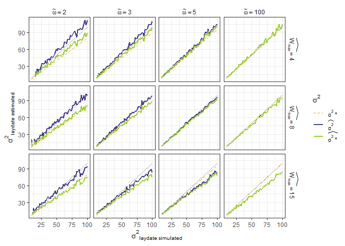
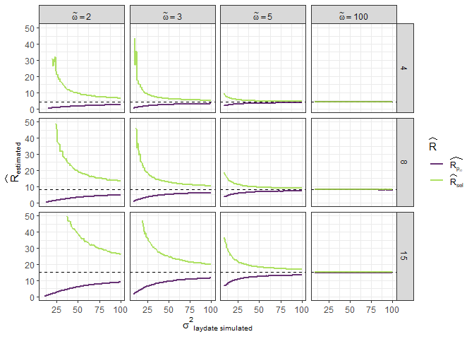

Simulations with varying selection & variance
================
Paul Cuchot
2024-08-08

### Function to simulate data

- One year, one site

``` r
# - selection with optimum 
simul_data <- function(n_breeders = 1000, # number of pairs
                       n_session = 150, # number of capture session 
                       start_ces = 50, # time at first session  
                       end_ces = 200, # last session  
                       sd_ld = sd_,  # sd laying date
                       mean_ld = 90, # mean laying date
                       fact_omega = omeg,# = omega tilde
                       mean_eggs = 8, # mean number of eggs per pair
                       shiftopt = 10){ # Distance to optimum  
  
  # final data_set
  df_site <- data.frame(t = NA,
                        n_capt_adults = NA,
                        n_capt_juveniles = NA, 
                        prod = NA,
                        year = NA)[0,] 
  
  ## PHENOLOGY ##
  
  # sample n_breeders laying events
  ld_dates <- round(rnorm(n_breeders, 
                          mean = mean_ld, 
                          sd = sd_ld))# or sd_ld[k]
  
  # fledglings dates (40 = incubation time + rising)
  # imply that they all fledge at the same time 
  
  fledgl_dates <- ld_dates+40
  
  ## FECUNDITY ##
  
  # optimum
  omega2 <-  fact_omega*sd_ld  # peak width
  opt <- mean_ld - shiftopt
  
  #fitness function
  fitness <- exp(-(ld_dates - opt)^2/(2*omega2^2))
  
  n_eggs <- rpois(n_breeders, 
                  lambda = mean_eggs*fitness)
  
  # create a dataframe (one row per breeding pair)
  df_breed <- data.frame(
    ld_date = ld_dates,
    n_egg = n_eggs,
    fledgl_dates = fledgl_dates
  )
  
  
  #### sample (as CES design) #### 
  
  # choose days for capture session
  t_capt <- round(seq(start_ces, end_ces, 
                      length.out = n_session))

  mean_n_capt <- 200
  
  # Dataframe with n_adults and n_juveniles captured per session
  df_session <- data.frame(t = t_capt,
                           n_capt_adults = NA,
                           n_capt_juveniles = NA,
                           prod = NA,
                           year = as.character(k)) 
  
  for(i in t_capt){
    
    # catchable adults (no variation of survival during the season)
    n_adults <- n_breeders * 2
    
    # catchable juveniles (no variation of survival during the season)
    n_juveniles <- sum(df_breed[df_breed$fledgl_date < i ,]$n_egg)
    
    # sample birds among available individuals
    capt_indiv <- sample( 
      c(rep(0,n_adults), # adults
        rep(1,n_juveniles)), # juveniles
      rpois(1,mean_n_capt),
      
      replace = TRUE # allow recapture
    ) 
    
    # --> adults and juveniles have the same capture probability
    
    # how many adults
    df_session[df_session$t == i,"n_capt_adults"] <- sum(capt_indiv == 0)
    
    # how many juveniles
    df_session[df_session$t ==i,"n_capt_juveniles"] <- sum(capt_indiv == 1) 
    
  }
  
  # calculate productivity
  df_session <- df_session%>%
    mutate(prod = n_capt_juveniles/(n_capt_adults+n_capt_juveniles))
  
  df_site <- rbind(df_site, df_session)
  
  
  # df with mean ld per year ("real breeding date")
  df_mean_ld <- data.frame(mean_ld = mean_ld)
  
  
  return(list(capt_sess = df_site, 
              mean_ld_year = df_mean_ld))
  
}
```

#### Simulate data

``` r
shiftopt = 20
k = 1
z = 1
df_rec <- list()
n_rep <- 10


for(omega_til in c(2,3,5, 100)){
  
  for(n_eggs in c(4,8,15)){ # mean laying date
    
    for(sd_ in seq(3,10, by = 0.1)){  # variance in laying date
      # for(sd_ in c(2,5,10)){  # variance in laying date
      
      for(q in 1:n_rep){
        
        # simulate data
        data_sim <- simul_data(n_breeders = 1000, # number of pairs
                               n_session = 150, 
                               start_ces = 50,
                               end_ces = 200,
                               mean_ld = 90,
                               # selection_stre_ld = -0.003,
                               sd_ld = sd_,
                               fact_omega = omega_til,
                               # mean number of eggs per pair
                               mean_eggs = n_eggs, 
                               shiftopt = shiftopt) 
        
        
        md_sim <- try(nls(prod ~ pinf/(1+exp((tm-t)/b)),
                          data = data_sim$capt_sess,
                          start = list(tm = 120, b = 3, pinf = 0.6)))
        
        # few model don't converge, here is a way to skip them 
        if(class(md_sim) == "try-error"){
          
          tm = NA
          b = NA
          pinf = NA
          
          # create data frame recording everything
          df_rec[[k]] <- data.frame(
            # get model parameters
            tm = NA,
            b = NA,
            pinf = NA,
            
            # tm - 40
            tm_m40 = NA,
            
            # mu bar * (mean breeding date from model parameters)
            mu_bar_star = NA,
            
            # sigma bar * (variance from model parameters)
            var_bar_star = NA,
            
            # mu* (from fitness function)
            mu_bar = NA,
            
            # sigma* (from fitness function)
            var_bar = NA,
            
            # from observed data (after selection ) 
            R_hat = NA, 
            
            # when taking selection
            R_hat_sel = NA,
            
            # add parameters
            sim_sd_sl = sd_,
            n_eggs = n_eggs,
            omega_tilde = omega_til, 
            sim = z)
          
          k = k+1
          
        }else{
          
          tm = as.data.frame(coef(md_sim))[1,1]
          b = as.data.frame(coef(md_sim))[2,1]
          pinf = as.data.frame(coef(md_sim))[3,1]
          
          # create data frame recording everything
          df_rec[[k]] <- data.frame(
            # get model parameters
            tm = tm,
            b = b,
            pinf = pinf,
            
            # tm - 40
            tm_m40 = tm - 40,
            
            # mu bar *  equation 13
            mu_bar_star = tm - 40 - b*log(1-pinf),
            
            # sigma bar * equation 14
            var_bar_star = ((pi^2)*b^2)/3,
            
            # knowing selection parameters
            # mu bar  equation 19
            mu_bar =  (tm - 40 - b*log(1-pinf))+(shiftopt)/((omega_til^2)+1),
            
            # sigma bar  equation 19
            var_bar = (((omega_til^2)+1)/(omega_til^2))*(((pi^2)*b^2)/3),
            
            # from observed data (after selection ) 
            R_hat = (2*pinf)/(1-pinf), 
            
            # when taking selection
            R_hat_sel = n_eggs*sqrt(((omega_til^2)+1)/(omega_til^2))*exp(((shiftopt^2)/((((omega_til^2)+1)/(omega_til^2))*(((pi^2)*b^2)/3)))/(2*(omega_til^2+1))),
            
            # add parameters
            sim_sd_sl = sd_,
            n_eggs = n_eggs,
            omega_tilde = omega_til, 
            sim = z)
          
          k = k+1
          
        }
      }
      z = z+1
    }
  }
}


df_simul3 <- bind_rows(df_rec)
saveRDS(df_simul3, "data_simul.rds")
```

``` r
df_simul3 <- readRDS("data_simul.rds")
```

#### Compare pre and post selection estimates of laying dates with varying variance (in laying dates, ${\sigma^2}_{simulated}$), optimum width (selection pressure, $\tilde{\omega}$) and maximum number of eggs ($W_{max}$)

<!-- -->

#### Same for pre and post selection estimates of variance

<!-- -->

#### Same for reproductive rate

- $\widehat{R}_{p_{\infty}}$ is directly calculated from $p_{\infty}$
  (see equation 10)
- $\widehat{R}_{sel}$ is calculated knowing selection parameters (see
  equation 19)

<!-- -->
