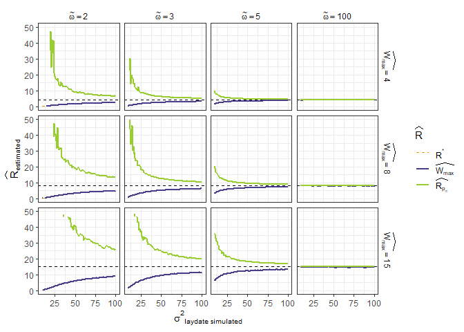

Simulations with varying selection & variance
================
Paul Cuchot
2024-08-08

### Function to simulate data

- One year, one site

``` r
simul_data <- function(n_breeders = 1000, # number of pair
                       n_session = 150, 
                       start_ces = 50,
                       end_ces = 200,
                       # mean_ld_site = 90,
                       # selection_stre_ld = -0.003,
                       sd_ld = sd_,
                       mean_ld = 90,
                       fact_omega = omeg,
                       # mean number of eggs per pair
                       mean_eggs = 8, 
                       shiftopt = 10){
  
  # final data_set
  df_site <- data.frame(t = NA,
                        n_capt_adults = NA,
                        n_capt_juveniles = NA, 
                        prod = NA,
                        year = NA)[0,] 
  
  ## PHENOLOGY ##
  
  # sample n_breeders laying events
  ld_dates <- round(rnorm(n_breeders, 
                          mean = mean_ld, 
                          sd = sd_ld))# or sd_ld[k]
  
  # fledglings dates (40 = incubation time + rising)
  # imply that they all fledge at the same time 
  
  fledgl_dates <- ld_dates+40
  
  ## FECUNDITY ##
  
  # optimum
  omega2 <-  fact_omega*sd_ld  # peak width
  opt <- mean_ld - shiftopt
  
  #fitness function
  fitness <- exp(-(ld_dates - opt)^2/(2*omega2^2))
  
  n_eggs <- rpois(n_breeders, 
                  lambda = mean_eggs*fitness)
  
  
  # create a dataframe (one row per breeding pair)
  df_breed <- data.frame(
    ld_date = ld_dates,
    n_egg = n_eggs,
    fledgl_dates = fledgl_dates
  )
  
  
  #### sample (as CES design) #### 
  
  # choose days for capture session
  t_capt <- round(seq(start_ces, end_ces, 
                      length.out = n_session))
  
  mean_n_capt <- 200
  
  # Dataframe with n_adults and n_juveniles captured per session
  df_session <- data.frame(t = t_capt,
                           n_capt_adults = NA,
                           n_capt_juveniles = NA,
                           prod = NA,
                           year = as.character(k)) 
  
  for(i in t_capt){
    
    # catchable adults (no variation of survival during the season)
    n_adults <- n_breeders * 2
    
    # catchable juveniles (no variation of survival during the season)
    n_juveniles <- sum(df_breed[df_breed$fledgl_date < i ,]$n_egg)
    
    # sample birds among available individuals
    capt_indiv <- sample( 
      c(rep(0,n_adults), # adults
        rep(1,n_juveniles)), # juveniles
      rpois(1,mean_n_capt),
      
      replace = TRUE # allow recapture
    ) 
    
    # --> adults and juveniles have the same capture probability
    
    # how many adults
    df_session[df_session$t == i,"n_capt_adults"] <- sum(capt_indiv == 0)
    
    # how many juveniles
    df_session[df_session$t ==i,"n_capt_juveniles"] <- sum(capt_indiv == 1) 
    
  }
  
  # calculate productivity
  df_session <- df_session%>%
    mutate(prod = n_capt_juveniles/(n_capt_adults+n_capt_juveniles))
  
  df_site <- rbind(df_site, df_session)
  
  
  # df with mean ld per year ("real breeding date")
  df_mean_ld <- data.frame(mean_ld = mean_ld)
  
  
  return(list(capt_sess = df_site, 
              mean_ld_year = df_mean_ld,
              R_et = mean(n_eggs),
              # mu_star = mean(fitness*ld_dates),
              mu_star = mean_ld-(shiftopt/((fact_omega^1)+1)),
              # var_star = var(fitness*ld_dates)))
              var_star = ((fact_omega^2)/((fact_omega^2)+1))*(sd_ld^2)))
  
}


# df_simul3 <- bind_rows(df_rec)
# saveRDS(df_simul3, "data_simul.rds")
```

``` r
df_simul3 <- readRDS("data_simul.rds")
```

#### Compare pre and post selection estimates of laying dates with varying variance (in laying dates, ${\sigma^2}_{simulated}$), optimum width (selection pressure, $\tilde{\omega}$) and maximum number of eggs ($W_{max}$)

<!-- -->

#### Same for pre and post selection estimates of variance

<!-- -->

#### Same for reproductive rate

- $\widehat{R}_{p_{\infty}}$ is directly calculated from $p_{\infty}$
  (see equation 10)
- $\widehat{R}_{sel}$ is calculated knowing selection parameters (see
  equation 19)

<!-- -->
