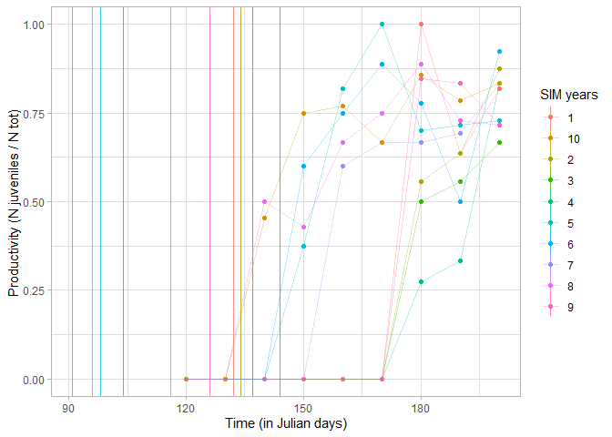
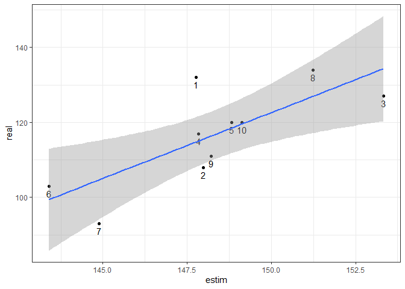

4_report_script_3
================
Paul Cuchot
02/05/2023

## Test model with simulated data

### Library

``` r
# bayesian modeling + plot
require(R2jags)
require(MASS)
require(mcmcplots)

# general
require(tidyverse)
require(bayesplot)
```

### Simulate data

#### Assumption for simulated data

- Same number of breeders between years (5 pairs)
- Mean number of eggs = 8 (sd = 5)
- All chicks fledge and survive
- Adults survive during the breeding season
- Between years, sessions are on the same days
- Birds do not migrate or immigrate during the breeding season
- Same capture probability between juveniles and adults

The function used to simulate data is described at the end of this
document.

``` r
# load function 
source("2_function_sim_data.R")
# number of year to simlate
Nyears = 10

prod <- simul_data(
  
  # 5 pairs of breeders per year
  n_breeders = 5,
  # 10 years
  n_years = 10,
  # CES start (julian days)
  start_ces = 120,
  # CES end (julian days)
  end_ces = 200,
  # sessions per year
  n_session = 9,
  # mean laying date for this site
  mean_ld_site = 120)
```

### plot productivity through time (sim data)

Productivity throught breeding period for a single site. The vertical
lines represent the simulated mean laying for each year.

<!-- -->

### Structure data for JAGS

``` r
prod_f <- prod$capt_sess %>%
  mutate(an = as.numeric(year))

# data for the model
data <- list(nt = prod_f$n_capt_juveniles+prod_f$n_capt_adults,
             n0 = prod_f$n_capt_juveniles,
             date = as.numeric(prod_f$t),
             N = nrow(prod_f),
             N_an = length(unique(prod_f$an)),
             an = prod_f$an
)
```

### Define model

``` r
model <- "model{
 
  # loop on capture session
 
  for(i in 1:N){
    
    ## likelihood
    n0[i] ~ dbin(p[i], nt[i])
    
    p[i] <- asig[an[i]]/(1+exp((csig[an[i]]-date[i])/dsig[an[i]]))
  }
 
  # loop on an

  for (ii in 1:N_an){
    
    # asig[ii] <- alpha_asig + random_asig_an[an_n[ii]]
    # csig[ii] <- alpha_csig + random_csig_an[an_n[ii]]
    # dsig[ii] <- alpha_dsig + random_dsig_an[an_n[ii]]
    
    asig[ii] <- alpha_asig + random_asig_an[ii]
    csig[ii] <- alpha_csig + random_csig_an[ii]
    dsig[ii] <- alpha_dsig + random_dsig_an[ii]
    
    random_asig_an[ii] ~ dnorm(0, tau_asig_an)
    random_csig_an[ii] ~ dnorm(0, tau_csig_an)
    random_dsig_an[ii] ~ dnorm(0, tau_dsig_an)
 
  }

  alpha_asig ~ dnorm(0.7,0.1)T(0,1)
  alpha_csig ~ dnorm(150,0.1)T(100,200)
  alpha_dsig ~ dnorm(7,0.1)T(0,15)
 
#folded Cauchy version
  sigma_asig_an ~ dt(0, 0.01, 1)
  tau_asig_an <- pow(sigma_asig_an, -2)
 
#folded Cauchy version
  sigma_csig_an ~ dt(0, 0.01, 1)
  tau_csig_an <- pow(sigma_csig_an, -2)
  
  sigma_dsig_an ~ dt(0, 0.01, 1)
  tau_dsig_an <- pow(sigma_dsig_an, -2)

}
"
```

### Create initial values and parameters to save

``` r
init_f <-  function(){
  
  list(
    
    alpha_asig = runif(1, 0, 1),
    alpha_dsig = runif(1, 3, 10),
    alpha_csig = rnorm(1, 150, 20),
    
    sigma_asig_an = rnorm(1, 3, 20),
    sigma_csig_an = rnorm(1, 3, 20),
    sigma_dsig_an = rnorm(1, 3, 20),
    
    random_asig_an = rnorm(Nyears, 0, 0.001),
    random_csig_an = rnorm(Nyears, 0, 0.001),
    random_dsig_an = rnorm(Nyears, 0, 0.001)
    
  )
}

inits <- list(init1 = init_f(), init2=init_f(), init3=init_f())

# parameter to save 
parameters3 <- c("asig","csig","dsig",
                 "random_asig_an","random_csig_an","random_dsig_an",
                 "sigma_csig_an","sigma_dsig_an","sigma_asig_an")
```

### Run model

``` r
# run model 
md_1 <- jags(data = data,
             parameters.to.save = parameters3,
             model.file = textConnection(model),
             inits = inits,
             n.chains = 3,
             n.iter = 10000,
             n.burnin = 3000)
```

    ## module glm loaded

    ## Compiling model graph
    ##    Resolving undeclared variables
    ##    Allocating nodes
    ## Graph information:
    ##    Observed stochastic nodes: 90
    ##    Unobserved stochastic nodes: 36
    ##    Total graph size: 893
    ## 
    ## Initializing model

### Look at convergence

``` r
md_1
```

    ## Inference for Bugs model at "4", fit using jags,
    ##  3 chains, each with 10000 iterations (first 3000 discarded), n.thin = 7
    ##  n.sims = 3000 iterations saved
    ##                    mu.vect sd.vect    2.5%     25%     50%     75%   97.5%
    ## asig[1]              0.757   0.035   0.685   0.735   0.757   0.779   0.824
    ## asig[2]              0.753   0.035   0.681   0.732   0.754   0.775   0.822
    ## asig[3]              0.749   0.032   0.679   0.729   0.750   0.769   0.806
    ## asig[4]              0.750   0.038   0.668   0.729   0.752   0.773   0.820
    ## asig[5]              0.770   0.041   0.697   0.743   0.765   0.791   0.867
    ## asig[6]              0.746   0.039   0.658   0.726   0.750   0.771   0.815
    ## asig[7]              0.748   0.040   0.656   0.727   0.750   0.772   0.821
    ## asig[8]              0.751   0.047   0.650   0.729   0.752   0.775   0.840
    ## asig[9]              0.744   0.038   0.659   0.724   0.747   0.768   0.810
    ## asig[10]             0.758   0.035   0.688   0.736   0.758   0.779   0.828
    ## csig[1]            155.046   2.059 151.213 153.495 155.015 156.587 158.856
    ## csig[2]            156.994   2.497 151.695 155.193 157.478 158.978 160.852
    ## csig[3]            136.508   2.489 131.319 134.726 136.836 138.451 140.378
    ## csig[4]            175.588   2.430 171.116 173.694 175.643 177.582 179.678
    ## csig[5]            158.381   2.926 151.871 156.671 159.171 160.295 163.200
    ## csig[6]            166.335   2.757 161.192 164.283 166.498 168.512 171.245
    ## csig[7]            184.111   2.347 179.991 182.377 184.076 185.812 188.536
    ## csig[8]            195.541   2.755 190.842 193.319 195.467 197.672 200.557
    ## csig[9]            158.830   2.318 152.648 158.014 159.425 160.254 162.135
    ## csig[10]           147.045   2.581 141.718 145.201 147.447 149.071 151.162
    ## dsig[1]              0.964   0.594   0.083   0.526   0.883   1.307   2.317
    ## dsig[2]              1.171   0.716   0.147   0.651   1.065   1.559   2.791
    ## dsig[3]              1.142   0.715   0.141   0.617   1.034   1.521   2.815
    ## dsig[4]              1.098   0.693   0.111   0.590   0.995   1.480   2.741
    ## dsig[5]              1.246   0.745   0.160   0.716   1.119   1.647   3.028
    ## dsig[6]              1.166   0.772   0.133   0.633   1.046   1.508   3.194
    ## dsig[7]              1.031   0.644   0.092   0.567   0.938   1.387   2.499
    ## dsig[8]              1.114   0.728   0.116   0.583   0.996   1.478   2.934
    ## dsig[9]              1.283   0.786   0.169   0.729   1.146   1.679   3.236
    ## dsig[10]             1.197   0.739   0.157   0.663   1.092   1.576   3.015
    ## random_asig_an[1]    0.004   0.029  -0.057  -0.009   0.001   0.015   0.073
    ## random_asig_an[2]    0.001   0.029  -0.061  -0.011   0.000   0.013   0.064
    ## random_asig_an[3]   -0.004   0.027  -0.066  -0.015  -0.001   0.008   0.049
    ## random_asig_an[4]   -0.003   0.032  -0.075  -0.014  -0.001   0.010   0.061
    ## random_asig_an[5]    0.017   0.037  -0.037  -0.003   0.006   0.031   0.115
    ## random_asig_an[6]   -0.006   0.031  -0.086  -0.017  -0.001   0.008   0.051
    ## random_asig_an[7]   -0.005   0.033  -0.082  -0.016  -0.001   0.008   0.057
    ## random_asig_an[8]   -0.002   0.038  -0.085  -0.014  -0.001   0.011   0.072
    ## random_asig_an[9]   -0.009   0.031  -0.088  -0.020  -0.003   0.006   0.046
    ## random_asig_an[10]   0.005   0.029  -0.052  -0.008   0.002   0.017   0.075
    ## random_csig_an[1]    1.975   3.551  -4.861  -0.469   1.978   4.365   8.905
    ## random_csig_an[2]    3.923   3.853  -3.905   1.329   4.065   6.680  10.791
    ## random_csig_an[3]  -16.563   3.753 -24.062 -19.118 -16.464 -13.966  -9.442
    ## random_csig_an[4]   22.517   3.821  15.187  19.861  22.598  25.159  30.125
    ## random_csig_an[5]    5.310   4.096  -3.131   2.623   5.578   8.202  12.639
    ## random_csig_an[6]   13.264   3.974   5.553  10.496  13.279  16.048  21.040
    ## random_csig_an[7]   31.040   3.751  23.881  28.505  31.106  33.669  38.388
    ## random_csig_an[8]   42.470   3.995  34.885  39.633  42.408  45.183  50.204
    ## random_csig_an[9]    5.759   3.699  -2.096   3.406   5.944   8.343  12.466
    ## random_csig_an[10]  -6.026   3.870 -13.675  -8.666  -5.961  -3.215   1.057
    ## random_dsig_an[1]   -0.195   0.503  -1.449  -0.371  -0.063   0.051   0.582
    ## random_dsig_an[2]    0.012   0.486  -0.999  -0.166   0.002   0.174   1.078
    ## random_dsig_an[3]   -0.017   0.500  -1.082  -0.191  -0.003   0.148   1.070
    ## random_dsig_an[4]   -0.061   0.481  -1.172  -0.249  -0.020   0.110   0.924
    ## random_dsig_an[5]    0.087   0.479  -0.823  -0.106   0.019   0.251   1.220
    ## random_dsig_an[6]    0.007   0.528  -1.028  -0.194  -0.005   0.170   1.245
    ## random_dsig_an[7]   -0.128   0.496  -1.376  -0.310  -0.039   0.082   0.753
    ## random_dsig_an[8]   -0.045   0.510  -1.127  -0.231  -0.013   0.118   1.008
    ## random_dsig_an[9]    0.124   0.522  -0.797  -0.086   0.029   0.274   1.349
    ## random_dsig_an[10]   0.037   0.491  -0.939  -0.145   0.004   0.198   1.228
    ## sigma_asig_an        0.004   0.039  -0.077  -0.019   0.006   0.026   0.080
    ## sigma_csig_an       -6.937  20.305 -32.335 -21.535 -17.233  16.856  29.457
    ## sigma_dsig_an       -0.038   0.605  -1.250  -0.378  -0.064   0.288   1.227
    ## deviance           151.616   5.239 143.300 147.950 150.910 154.540 164.660
    ##                     Rhat n.eff
    ## asig[1]            1.001  3000
    ## asig[2]            1.001  3000
    ## asig[3]            1.001  3000
    ## asig[4]            1.002  1600
    ## asig[5]            1.003  1100
    ## asig[6]            1.001  3000
    ## asig[7]            1.002  1900
    ## asig[8]            1.006  3000
    ## asig[9]            1.001  3000
    ## asig[10]           1.001  3000
    ## csig[1]            1.001  3000
    ## csig[2]            1.001  3000
    ## csig[3]            1.001  2200
    ## csig[4]            1.002  1200
    ## csig[5]            1.001  3000
    ## csig[6]            1.002  2000
    ## csig[7]            1.001  3000
    ## csig[8]            1.001  3000
    ## csig[9]            1.001  3000
    ## csig[10]           1.003   760
    ## dsig[1]            1.001  3000
    ## dsig[2]            1.003  3000
    ## dsig[3]            1.002  3000
    ## dsig[4]            1.001  3000
    ## dsig[5]            1.001  3000
    ## dsig[6]            1.001  2700
    ## dsig[7]            1.002  2600
    ## dsig[8]            1.002  1600
    ## dsig[9]            1.001  3000
    ## dsig[10]           1.001  2200
    ## random_asig_an[1]  1.003  3000
    ## random_asig_an[2]  1.004  3000
    ## random_asig_an[3]  1.005  2800
    ## random_asig_an[4]  1.006  1000
    ## random_asig_an[5]  1.007  1100
    ## random_asig_an[6]  1.003  3000
    ## random_asig_an[7]  1.007  1400
    ## random_asig_an[8]  1.012  2600
    ## random_asig_an[9]  1.006  1600
    ## random_asig_an[10] 1.002  3000
    ## random_csig_an[1]  1.003  1200
    ## random_csig_an[2]  1.002  1800
    ## random_csig_an[3]  1.006   610
    ## random_csig_an[4]  1.007   500
    ## random_csig_an[5]  1.003   930
    ## random_csig_an[6]  1.011   460
    ## random_csig_an[7]  1.006   620
    ## random_csig_an[8]  1.004  1000
    ## random_csig_an[9]  1.006   650
    ## random_csig_an[10] 1.008   350
    ## random_dsig_an[1]  1.001  3000
    ## random_dsig_an[2]  1.005  2200
    ## random_dsig_an[3]  1.002  1600
    ## random_dsig_an[4]  1.001  3000
    ## random_dsig_an[5]  1.005  3000
    ## random_dsig_an[6]  1.001  3000
    ## random_dsig_an[7]  1.002  1700
    ## random_dsig_an[8]  1.001  2200
    ## random_dsig_an[9]  1.003  3000
    ## random_dsig_an[10] 1.002  2700
    ## sigma_asig_an      1.141    20
    ## sigma_csig_an      6.887     3
    ## sigma_dsig_an      1.099    25
    ## deviance           1.001  2600
    ## 
    ## For each parameter, n.eff is a crude measure of effective sample size,
    ## and Rhat is the potential scale reduction factor (at convergence, Rhat=1).
    ## 
    ## DIC info (using the rule, pD = var(deviance)/2)
    ## pD = 13.7 and DIC = 165.3
    ## DIC is an estimate of expected predictive error (lower deviance is better).

### Quickly compare mean xmid with ‘real pheno’

``` r
data.frame(estim = md_1$BUGSoutput$mean$c, 
           real = prod$mean_ld_year$mean_ld, 
           year = 1:Nyears)%>%
  ggplot(aes(x = estim, y = real, label = year))+
  geom_text(vjust = 1.5)+
  geom_point()+
  theme_bw()+
  stat_smooth(method = lm)
```

    ## `geom_smooth()` using formula = 'y ~ x'

    ## Warning: The following aesthetics were dropped during statistical transformation: label.
    ## ℹ This can happen when ggplot fails to infer the correct grouping structure in
    ##   the data.
    ## ℹ Did you forget to specify a `group` aesthetic or to convert a numerical
    ##   variable into a factor?

<!-- -->

## Annexe

### Function to simulate data

``` r
simul_data 
```
