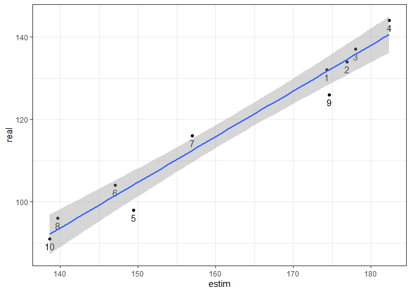

4_report_script_3
================
Paul Cuchot
02/05/2023

## Test model with simulated data

### Library

``` r
# bayesian modeling + plot
require(R2jags)
require(MASS)
require(mcmcplots)

# general
require(tidyverse)
require(bayesplot)
```

### Simulate data

#### Assumption for simulated data

- Same number of breeders between years (5 pairs)
- Mean number of eggs = 8 (sd = 5)
- All chicks fledge and survive
- Adults survive during the breeding season
- Between years, sessions are on the same days
- Birds do not migrate or immigrate during the breeding season
- Same capture probability between juveniles and adults

The function used to simulate data is described at the end of this
document.

``` r
# load function 
source("2_function_sim_data.R")
# number of year to simlate
Nyears = 10

prod <- simul_data(
  
  # 5 pairs of breeders per year
  n_breeders = 5,
  # 10 years
  n_years = 10,
  # CES start (julian days)
  start_ces = 120,
  # CES end (julian days)
  end_ces = 200,
  # sessions per year
  n_session = 9,
  # mean laying date for this site
  mean_ld_site = 120)
```

### plot productivity through time (sim data)

Productivity throught breeding period for a single site. The vertical
lines represent the simulated mean laying for each year.

<!-- -->

### Structure data for JAGS

``` r
prod_f <- prod$capt_sess %>%
  mutate(an = as.numeric(year))

# data for the model
data <- list(nt = prod_f$n_capt_juveniles+prod_f$n_capt_adults,
             n0 = prod_f$n_capt_juveniles,
             date = as.numeric(prod_f$t),
             N = nrow(prod_f),
             N_an = length(unique(prod_f$an)),
             an = prod_f$an
)
```

### Define model

``` r
model <- "model{
 
  # loop on capture session
 
  for(i in 1:N){
    
    ## likelihood
    n0[i] ~ dbin(p[i], nt[i])
    
    p[i] <- asig[an[i]]/(1+exp((csig[an[i]]-date[i])/dsig[an[i]]))
  }
 
  # loop on an

  for (ii in 1:N_an){
    
    # asig[ii] <- alpha_asig + random_asig_an[an_n[ii]]
    # csig[ii] <- alpha_csig + random_csig_an[an_n[ii]]
    # dsig[ii] <- alpha_dsig + random_dsig_an[an_n[ii]]
    
    asig[ii] <- alpha_asig + random_asig_an[ii]
    csig[ii] <- alpha_csig + random_csig_an[ii]
    dsig[ii] <- alpha_dsig + random_dsig_an[ii]
    
    random_asig_an[ii] ~ dnorm(0, tau_asig_an)
    random_csig_an[ii] ~ dnorm(0, tau_csig_an)
    random_dsig_an[ii] ~ dnorm(0, tau_dsig_an)
 
  }

  alpha_asig ~ dnorm(0.7,0.1)T(0,1)
  alpha_csig ~ dnorm(150,0.1)T(100,200)
  alpha_dsig ~ dnorm(7,0.1)T(0,15)
 
#folded Cauchy version
  sigma_asig_an ~ dt(0, 0.01, 1)
  tau_asig_an <- pow(sigma_asig_an, -2)
 
#folded Cauchy version
  sigma_csig_an ~ dt(0, 0.01, 1)
  tau_csig_an <- pow(sigma_csig_an, -2)
  
  sigma_dsig_an ~ dt(0, 0.01, 1)
  tau_dsig_an <- pow(sigma_dsig_an, -2)

}
"
```

### Create initial values and parameters to save

``` r
init_f <-  function(){
  
  list(
    
    alpha_asig = runif(1, 0, 1),
    alpha_dsig = runif(1, 3, 10),
    alpha_csig = rnorm(1, 150, 20),
    
    sigma_asig_an = rnorm(1, 3, 20),
    sigma_csig_an = rnorm(1, 3, 20),
    sigma_dsig_an = rnorm(1, 3, 20),
    
    random_asig_an = rnorm(Nyears, 0, 0.001),
    random_csig_an = rnorm(Nyears, 0, 0.001),
    random_dsig_an = rnorm(Nyears, 0, 0.001)
    
  )
}

inits <- list(init1 = init_f(), init2=init_f(), init3=init_f())

# parameter to save 
parameters3 <- c("asig","csig","dsig",
                 "random_asig_an","random_csig_an","random_dsig_an",
                 "sigma_csig_an","sigma_dsig_an","sigma_asig_an")
```

### Run model

``` r
# run model 
md_1 <- jags(data = data,
             parameters.to.save = parameters3,
             model.file = textConnection(model),
             inits = inits,
             n.chains = 3,
             n.iter = 10000,
             n.burnin = 3000)
```

    ## module glm loaded

    ## Compiling model graph
    ##    Resolving undeclared variables
    ##    Allocating nodes
    ## Graph information:
    ##    Observed stochastic nodes: 90
    ##    Unobserved stochastic nodes: 36
    ##    Total graph size: 893
    ## 
    ## Initializing model

### Look at convergence

``` r
md_1
```

    ## Inference for Bugs model at "4", fit using jags,
    ##  3 chains, each with 10000 iterations (first 3000 discarded), n.thin = 7
    ##  n.sims = 3000 iterations saved
    ##                    mu.vect sd.vect    2.5%     25%     50%     75%   97.5%
    ## asig[1]              0.744   0.048   0.653   0.718   0.742   0.769   0.849
    ## asig[2]              0.747   0.038   0.678   0.723   0.746   0.769   0.827
    ## asig[3]              0.742   0.039   0.666   0.719   0.742   0.766   0.824
    ## asig[4]              0.743   0.035   0.673   0.721   0.742   0.766   0.816
    ## asig[5]              0.751   0.040   0.678   0.726   0.748   0.774   0.839
    ## asig[6]              0.733   0.044   0.631   0.710   0.736   0.761   0.816
    ## asig[7]              0.726   0.043   0.622   0.704   0.730   0.754   0.799
    ## asig[8]              0.750   0.038   0.678   0.725   0.747   0.772   0.830
    ## asig[9]              0.737   0.033   0.667   0.717   0.738   0.759   0.799
    ## asig[10]             0.725   0.038   0.639   0.701   0.729   0.750   0.790
    ## csig[1]            194.706   2.447 190.273 192.944 194.682 196.533 199.212
    ## csig[2]            155.388   2.538 150.535 153.513 155.608 157.363 159.573
    ## csig[3]            157.782   2.239 152.365 156.575 158.296 159.398 161.019
    ## csig[4]            136.766   2.369 131.682 135.177 137.013 138.577 140.624
    ## csig[5]            165.921   2.280 161.456 164.322 166.007 167.654 169.965
    ## csig[6]            187.948   2.574 182.139 186.447 188.410 189.776 192.184
    ## csig[7]            167.732   2.819 162.142 165.835 167.960 169.514 173.421
    ## csig[8]            150.431   1.807 146.266 149.564 150.484 151.416 153.911
    ## csig[9]            136.559   2.513 131.243 134.873 136.907 138.406 140.546
    ## csig[10]           127.432   2.321 122.146 126.061 127.847 129.116 130.967
    ## dsig[1]              1.437   0.757   0.169   0.899   1.369   1.887   3.107
    ## dsig[2]              1.493   0.758   0.215   0.955   1.433   1.955   3.149
    ## dsig[3]              1.678   0.815   0.327   1.106   1.588   2.147   3.559
    ## dsig[4]              1.529   0.778   0.232   0.983   1.469   1.999   3.208
    ## dsig[5]              1.381   0.709   0.199   0.871   1.345   1.822   2.939
    ## dsig[6]              1.650   0.807   0.312   1.082   1.575   2.112   3.449
    ## dsig[7]              1.697   0.939   0.297   1.070   1.548   2.146   4.031
    ## dsig[8]              1.747   0.785   0.496   1.198   1.646   2.188   3.553
    ## dsig[9]              1.598   0.830   0.288   1.021   1.508   2.055   3.489
    ## dsig[10]             1.659   0.893   0.294   1.059   1.540   2.112   3.818
    ## random_asig_an[1]    0.005   0.040  -0.074  -0.011   0.001   0.018   0.099
    ## random_asig_an[2]    0.008   0.033  -0.057  -0.007   0.003   0.021   0.085
    ## random_asig_an[3]    0.002   0.032  -0.064  -0.011   0.000   0.016   0.076
    ## random_asig_an[4]    0.003   0.030  -0.061  -0.010   0.001   0.016   0.074
    ## random_asig_an[5]    0.011   0.034  -0.047  -0.006   0.004   0.026   0.096
    ## random_asig_an[6]   -0.007   0.036  -0.098  -0.021  -0.002   0.010   0.060
    ## random_asig_an[7]   -0.013   0.036  -0.110  -0.026  -0.005   0.004   0.044
    ## random_asig_an[8]    0.010   0.033  -0.048  -0.007   0.004   0.024   0.091
    ## random_asig_an[9]   -0.003   0.029  -0.070  -0.016  -0.001   0.011   0.058
    ## random_asig_an[10]  -0.015   0.034  -0.101  -0.029  -0.007   0.002   0.042
    ## random_csig_an[1]   43.129   3.741  35.683  40.626  43.140  45.600  50.408
    ## random_csig_an[2]    3.812   3.770  -3.641   1.285   3.821   6.460  10.990
    ## random_csig_an[3]    6.206   3.572  -0.988   3.841   6.337   8.654  12.875
    ## random_csig_an[4]  -14.810   3.658 -22.168 -17.225 -14.832 -12.343  -7.851
    ## random_csig_an[5]   14.345   3.651   7.018  11.908  14.320  16.852  21.090
    ## random_csig_an[6]   36.371   3.835  28.407  33.836  36.493  39.024  43.565
    ## random_csig_an[7]   16.155   3.935   8.422  13.639  16.237  18.752  23.821
    ## random_csig_an[8]   -1.145   3.304  -7.799  -3.229  -1.081   1.007   5.160
    ## random_csig_an[9]  -15.018   3.764 -22.489 -17.593 -14.951 -12.434  -7.763
    ## random_csig_an[10] -24.145   3.586 -31.504 -26.562 -24.018 -21.559 -17.461
    ## random_dsig_an[1]   -0.175   0.638  -1.684  -0.418  -0.079   0.120   1.027
    ## random_dsig_an[2]   -0.119   0.634  -1.602  -0.369  -0.042   0.162   1.128
    ## random_dsig_an[3]    0.067   0.615  -1.154  -0.199   0.022   0.311   1.496
    ## random_dsig_an[4]   -0.083   0.619  -1.492  -0.342  -0.032   0.183   1.146
    ## random_dsig_an[5]   -0.230   0.639  -1.766  -0.492  -0.108   0.101   0.846
    ## random_dsig_an[6]    0.038   0.601  -1.182  -0.213   0.018   0.279   1.328
    ## random_dsig_an[7]    0.085   0.725  -1.254  -0.216   0.007   0.313   1.806
    ## random_dsig_an[8]    0.135   0.579  -1.012  -0.131   0.057   0.366   1.448
    ## random_dsig_an[9]   -0.014   0.623  -1.358  -0.290  -0.006   0.231   1.340
    ## random_dsig_an[10]   0.048   0.668  -1.276  -0.234   0.003   0.270   1.725
    ## sigma_asig_an       -0.010   0.041  -0.090  -0.034  -0.011   0.015   0.073
    ## sigma_csig_an        7.866  22.356 -31.190 -18.889  19.119  23.951  34.860
    ## sigma_dsig_an        0.263   0.724  -1.172  -0.179   0.283   0.676   1.715
    ## deviance           158.332   5.674 149.263 154.215 157.622 161.700 172.237
    ##                     Rhat n.eff
    ## asig[1]            1.003  1500
    ## asig[2]            1.001  3000
    ## asig[3]            1.003   710
    ## asig[4]            1.001  3000
    ## asig[5]            1.002  1400
    ## asig[6]            1.002  1400
    ## asig[7]            1.001  3000
    ## asig[8]            1.004   570
    ## asig[9]            1.001  2900
    ## asig[10]           1.003  1500
    ## csig[1]            1.001  3000
    ## csig[2]            1.001  3000
    ## csig[3]            1.001  3000
    ## csig[4]            1.001  2600
    ## csig[5]            1.001  3000
    ## csig[6]            1.001  3000
    ## csig[7]            1.001  3000
    ## csig[8]            1.001  3000
    ## csig[9]            1.001  3000
    ## csig[10]           1.001  3000
    ## dsig[1]            1.005  1800
    ## dsig[2]            1.001  3000
    ## dsig[3]            1.002  2400
    ## dsig[4]            1.005  2600
    ## dsig[5]            1.006  1100
    ## dsig[6]            1.001  3000
    ## dsig[7]            1.004  3000
    ## dsig[8]            1.001  3000
    ## dsig[9]            1.001  3000
    ## dsig[10]           1.002  1800
    ## random_asig_an[1]  1.005  3000
    ## random_asig_an[2]  1.001  3000
    ## random_asig_an[3]  1.002  1300
    ## random_asig_an[4]  1.001  3000
    ## random_asig_an[5]  1.002  2200
    ## random_asig_an[6]  1.002  2700
    ## random_asig_an[7]  1.001  3000
    ## random_asig_an[8]  1.002  1100
    ## random_asig_an[9]  1.001  3000
    ## random_asig_an[10] 1.003  3000
    ## random_csig_an[1]  1.001  3000
    ## random_csig_an[2]  1.002  1200
    ## random_csig_an[3]  1.002  2100
    ## random_csig_an[4]  1.002  1100
    ## random_csig_an[5]  1.002  2000
    ## random_csig_an[6]  1.002  1500
    ## random_csig_an[7]  1.002  1600
    ## random_csig_an[8]  1.001  2000
    ## random_csig_an[9]  1.001  2700
    ## random_csig_an[10] 1.002  2400
    ## random_dsig_an[1]  1.005  1500
    ## random_dsig_an[2]  1.005  3000
    ## random_dsig_an[3]  1.003  3000
    ## random_dsig_an[4]  1.005  3000
    ## random_dsig_an[5]  1.007  1600
    ## random_dsig_an[6]  1.005  2900
    ## random_dsig_an[7]  1.017   550
    ## random_dsig_an[8]  1.008  1100
    ## random_dsig_an[9]  1.002  2900
    ## random_dsig_an[10] 1.001  2200
    ## sigma_asig_an      1.012   190
    ## sigma_csig_an      7.094     3
    ## sigma_dsig_an      1.057    40
    ## deviance           1.001  3000
    ## 
    ## For each parameter, n.eff is a crude measure of effective sample size,
    ## and Rhat is the potential scale reduction factor (at convergence, Rhat=1).
    ## 
    ## DIC info (using the rule, pD = var(deviance)/2)
    ## pD = 16.1 and DIC = 174.4
    ## DIC is an estimate of expected predictive error (lower deviance is better).

### Quickly compare mean xmid with ‘real pheno’

``` r
data.frame(estim = md_1$BUGSoutput$mean$c, 
           real = prod$mean_ld_year$mean_ld, 
           year = 1:Nyears)%>%
  ggplot(aes(x = estim, y = real, label = year))+
  geom_text(vjust = 1.5)+
  geom_point()+
  theme_bw()+
  stat_smooth(method = lm)
```

    ## `geom_smooth()` using formula = 'y ~ x'

    ## Warning: The following aesthetics were dropped during statistical transformation: label.
    ## ℹ This can happen when ggplot fails to infer the correct grouping structure in
    ##   the data.
    ## ℹ Did you forget to specify a `group` aesthetic or to convert a numerical
    ##   variable into a factor?

<!-- -->

## Annexe

### Function to simulate data

``` r
simul_data 
```
