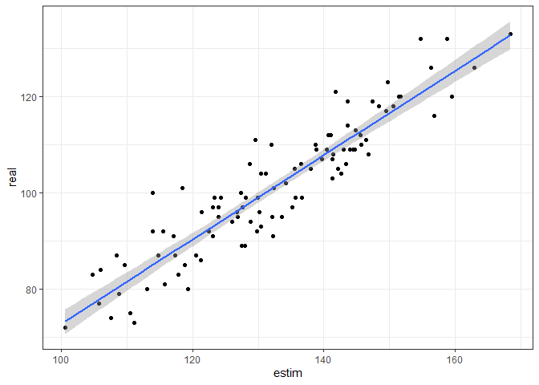
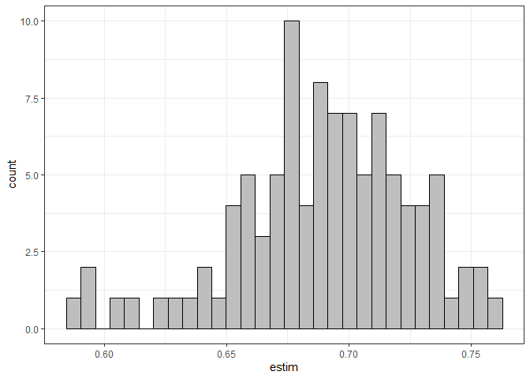
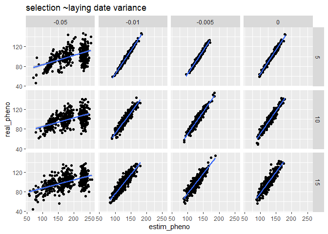
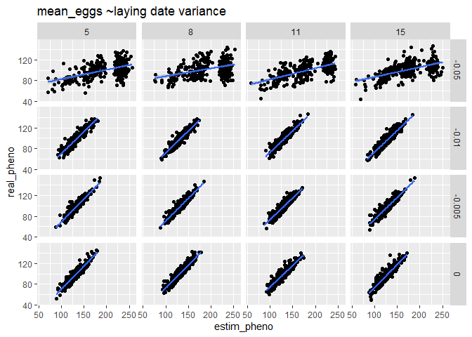

5_variance_and_selection
================
Paul Cuchot
2024-08-01

## Explore different variances in laying date and selection

1)  Create a function to simulated data:

- 1 site
- 1 year
- 1 fix mean laying date

``` r
simul_data <- function(n_breeders = 10, # number of pair
                       n_years = 10, 
                       n_session = 50, 
                       start_ces = 100,
                       end_ces = 200,
                       mean_ld_site = 90,
                       selection_stre_ld = -0.003,
                       sd_ld = 7,
                       # mean number of eggs per pair
                       mean_eggs = 8){
  
  
  # mean laying date (among breeding individuals - change between years)
  mean_ld <- round(rnorm(n_years, mean_ld_site, 15)) # (real pheno)
  
  # for selection/variance explorations
  # mean_ld <- 100
  
  
  
  # final data_set
  df_site <- data.frame(t = NA,
                        n_capt_adults = NA,
                        n_capt_juveniles = NA, 
                        prod = NA,
                        year = NA)[0,] 
  
  
  for(k in 1:n_years){
    
    ## PHENOLOGY ##
    
    # sample n_breeders laying events
    ld_dates <- round(rnorm(n_breeders, 
                            mean = mean_ld[k], 
                            sd = sd_ld))# or sd_ld[k]
    
    # fledglings dates (40 = incubation time + rising)
    # imply that they all fledge at the same time 
    
    fledgl_dates <- round(ld_dates)+40
    
    # number of eggs per pair
    
    ## FECUNDITY ##
    
    n_eggs <- rpois(n_breeders, 
                    lambda = mean_eggs*exp(selection_stre_ld*ld_dates))
    
    
    # create a dataframe (one row per breeding pair)
    df_breed <- data.frame(
      ld_date = ld_dates,
      n_egg = n_eggs,
      fledgl_dates = fledgl_dates
    )
    
    
    #### sample (as CES design) #### 
    
    # choose days for capture session
    t_capt <- round(seq(start_ces, end_ces, 
                        length.out = n_session))
    
    # Number of sample individual per session (~capture effort)
    # for now: does not vary along the season
    
    mean_n_capt <- 30
    
    # Dataframe with n_adults and n_juveniles captured per session
    df_session <- data.frame(t = t_capt,
                             n_capt_adults = NA,
                             n_capt_juveniles = NA,
                             prod = NA,
                             year = as.character(k)) 
    
    for(i in t_capt){
      
      # catchable adults (no variation of survival during the season)
      n_adults <- n_breeders * 2
      
      # catchable juveniles (no variation of survival during the season)
      n_juveniles <- sum(df_breed[df_breed$fledgl_date < i ,]$n_egg)
      
      # sample birds among available individuals
      capt_indiv <- sample( 
        c(rep(0,n_adults), # adults
          rep(1,n_juveniles)), # juveniles
        rpois(1,mean_n_capt),
        
        replace = TRUE # allow recapture
      ) 
      
      # --> adults and juveniles have the same capture probability
      
      # how many adults
      df_session[df_session$t == i,"n_capt_adults"] <- sum(capt_indiv == 0)
      
      # how many juveniles
      df_session[df_session$t ==i,"n_capt_juveniles"] <- sum(capt_indiv == 1) 
      
    }
    
    # calculate productivity
    df_session <- df_session%>%
      mutate(prod = n_capt_juveniles/(n_capt_adults+n_capt_juveniles))
    
    df_site <- rbind(df_site, df_session)
    
  }
  
  # df with mean ld per year ("real breeding date")
  df_mean_ld <- data.frame(year = 1:n_years,
                           mean_ld = mean_ld)
  
  return(list(capt_sess = df_site, 
              mean_ld_year = df_mean_ld))
  
}
```

2)  let vary laying date variance and selection

- layingdate_sd = 12 (high variance); no selection

``` r
data1 <- simul_data(n_breeders = 10, # number of pair
                    n_years = 10, 
                    n_session = 50, 
                    start_ces = 100,
                    end_ces = 200,
                    mean_ld_site = 100,
                    selection_stre_ld = 0,
                    sd_ld = 12,
                    mean_eggs = 8)
```

- layingdate_sd = 12 (high variance); selection = -0.01

``` r
data2 <- simul_data(n_breeders = 10, # number of pair
                    n_years = 10, 
                    n_session = 50, 
                    start_ces = 100,
                    end_ces = 200,
                    mean_ld_site = 100,
                    selection_stre_ld = -0.01,
                    sd_ld = 12,
                    mean_eggs = 8)
```

- layingdate_sd = 5 (high variance); no selection

``` r
data3 <- simul_data(n_breeders = 10, # number of pair
                    n_years = 10, 
                    n_session = 50, 
                    start_ces = 100,
                    end_ces = 200,
                    mean_ld_site = 100,
                    selection_stre_ld = 0,
                    sd_ld = 5,
                    mean_eggs = 8)
```

- layingdate_sd = 5 (high variance); selection = -0.01

``` r
data4 <- simul_data(n_breeders = 10, # number of pair
                    n_years = 10, 
                    n_session = 50, 
                    start_ces = 100,
                    end_ces = 200,
                    mean_ld_site = 100,
                    selection_stre_ld = -0.01,
                    sd_ld = 5,
                    mean_eggs = 8)
```

3)  Compare $N_{juveniles}/N_{adults}$ along season

``` r
gridExtra::grid.arrange(high_var_str_sel,
                        low_var_str_sel,
                        high_var_no_sel,
                        low_var_no_sel)
```

<!-- -->

## Estimate phenology, variance, final productivity with the model

1)  Structure data for JAGS

``` r
data5 <- simul_data(n_breeders = 10, # number of pair
                    n_years = 100, 
                    n_session = 50, 
                    start_ces = 100,
                    end_ces = 200,
                    mean_ld_site = 100,
                    selection_stre_ld = -0.005,
                    sd_ld = 12,
                    mean_eggs = 8)


prod_f <- data5$capt_sess %>%
  mutate(an = as.numeric(year))

# data for the model
data <- list(nt = prod_f$n_capt_juveniles+prod_f$n_capt_adults,
             n0 = prod_f$n_capt_juveniles,
             date = as.numeric(prod_f$t),
             N = nrow(prod_f),
             N_an = length(unique(prod_f$an)),
             an = prod_f$an
)
```

2)  Define model

``` r
model <- "model{

  # loop on capture session

  for(i in 1:N){

    ## likelihood
    n0[i] ~ dbin(p[i], nt[i])
    
    p[i] <- asig[an[i]]/(1+exp((csig[an[i]]-date[i])/dsig[an[i]]))
  }


  # loop on an_site_sp

  for (ii in 1:N_an){

  # csig parameter
  
    csig[ii] ~ dnorm(mu[ii], tau_res)

    mu[ii] <- mean_pheno + random_csig_an[an[ii]]

    
  # scale parameter
  
    dsig[ii] ~ dnorm(mu_dsig[ii], tau_res_dsig)
    
    mu_dsig[ii] <- mean_scale + random_dsig_an[an[ii]] 


  # asymptote parameter  
  
    asig[ii] ~ dnorm(mu_asig[ii], tau_res_asig)T(0.5,1)
    
    mu_asig[ii] <- mean_asymp + random_asig_an[an[ii]]
    
  }
  
  # random year effect
  
  for(z in 1:N_an){ #number of year
  
    random_csig_an[z] ~ dnorm(0, tau_csig_an)
    random_dsig_an[z] ~ dnorm(0, tau_dsig_an)
    random_asig_an[z] ~ dnorm(0, tau_asig_an)
  
  }

# priors

    mean_pheno ~ dnorm(150,0.01)

    mean_asymp ~ dnorm(0,0.01)T(0,1)
    
    mean_scale ~ dnorm(0,0.01)T(0,10)


  # random effect site

  sigma_res ~ dt(0, 0.01, 1)T(0,200) # Residual standard deviation
  sigma_res_dsig ~ dt(0, 0.01, 1)T(0,10) # Residual standard deviation
  sigma_res_asig ~ dt(0, 0.01, 1)T(0,1) # Residual standard deviation

  tau_res <- 1/(sigma_res*sigma_res)
  tau_res_dsig <- 1/(sigma_res_dsig*sigma_res_dsig)
  tau_res_asig <- 1/(sigma_res_asig*sigma_res_asig)

  #csig an (variance is the same for both species)
  sigma_csig_an ~ dt(0, 0.01, 1)T(0,200)
  tau_csig_an <- pow(sigma_csig_an, -2)
 
  # dsig an
  sigma_dsig_an ~ dt(0, 0.01, 1)T(0,20)
  tau_dsig_an <- pow(sigma_dsig_an, -2)

  # asig an
  sigma_asig_an ~ dt(0, 0.01, 1)T(0,1)
  tau_asig_an <- pow(sigma_asig_an, -2)


}
"
```

### parameters to save

``` r
# parameter to save 
parameters3 <- c("asig","csig","dsig")
```

### Run model

``` r
# run model 
md_1 <- jags(data = data,
             parameters.to.save = parameters3,
             model.file = textConnection(model),
             n.chains = 3,
             n.iter = 150,
             n.burnin = 50)
```

    ## Compiling model graph
    ##    Resolving undeclared variables
    ##    Allocating nodes
    ## Graph information:
    ##    Observed stochastic nodes: 5000
    ##    Unobserved stochastic nodes: 609
    ##    Total graph size: 45636
    ## 
    ## Initializing model

### Look at convergence

``` r
md_1
```

    ## Inference for Bugs model at "4", fit using jags,
    ##  3 chains, each with 150 iterations (first 50 discarded)
    ##  n.sims = 300 iterations saved
    ##             mu.vect sd.vect      2.5%       25%       50%       75%     97.5%
    ## asig[1]       0.661   0.016     0.633     0.650     0.661     0.673     0.695
    ## asig[2]       0.743   0.012     0.716     0.735     0.744     0.752     0.766
    ## asig[3]       0.624   0.018     0.592     0.613     0.623     0.636     0.656
    ## asig[4]       0.679   0.015     0.650     0.670     0.679     0.689     0.708
    ## asig[5]       0.648   0.015     0.618     0.639     0.648     0.656     0.677
    ## asig[6]       0.684   0.017     0.649     0.674     0.686     0.697     0.716
    ## asig[7]       0.693   0.017     0.660     0.681     0.691     0.704     0.728
    ## asig[8]       0.720   0.015     0.688     0.712     0.721     0.730     0.746
    ## asig[9]       0.736   0.017     0.706     0.725     0.735     0.748     0.768
    ## asig[10]      0.705   0.015     0.678     0.695     0.706     0.716     0.736
    ## asig[11]      0.658   0.022     0.615     0.642     0.656     0.673     0.703
    ## asig[12]      0.708   0.017     0.677     0.697     0.709     0.718     0.741
    ## asig[13]      0.719   0.012     0.697     0.711     0.718     0.727     0.743
    ## asig[14]      0.733   0.016     0.704     0.724     0.734     0.744     0.763
    ## asig[15]      0.674   0.020     0.638     0.661     0.674     0.687     0.711
    ## asig[16]      0.694   0.014     0.668     0.684     0.693     0.704     0.720
    ## asig[17]      0.661   0.017     0.630     0.649     0.660     0.673     0.693
    ## asig[18]      0.674   0.016     0.642     0.663     0.673     0.684     0.707
    ## asig[19]      0.668   0.016     0.636     0.657     0.669     0.679     0.694
    ## asig[20]      0.710   0.016     0.682     0.699     0.710     0.719     0.745
    ## asig[21]      0.666   0.016     0.636     0.655     0.665     0.678     0.693
    ## asig[22]      0.690   0.017     0.661     0.679     0.690     0.702     0.722
    ## asig[23]      0.694   0.019     0.659     0.682     0.693     0.705     0.732
    ## asig[24]      0.722   0.015     0.694     0.713     0.721     0.732     0.750
    ## asig[25]      0.729   0.016     0.694     0.720     0.729     0.738     0.760
    ## asig[26]      0.702   0.014     0.676     0.692     0.702     0.713     0.729
    ## asig[27]      0.675   0.016     0.645     0.664     0.674     0.685     0.705
    ## asig[28]      0.716   0.017     0.682     0.705     0.718     0.726     0.751
    ## asig[29]      0.676   0.015     0.649     0.666     0.674     0.685     0.708
    ## asig[30]      0.697   0.014     0.670     0.687     0.697     0.707     0.725
    ## asig[31]      0.693   0.015     0.664     0.684     0.694     0.703     0.719
    ## asig[32]      0.666   0.015     0.634     0.655     0.667     0.677     0.693
    ## asig[33]      0.686   0.015     0.655     0.676     0.687     0.696     0.717
    ## asig[34]      0.769   0.014     0.737     0.759     0.769     0.779     0.792
    ## asig[35]      0.630   0.023     0.584     0.615     0.630     0.644     0.683
    ## asig[36]      0.699   0.013     0.676     0.691     0.698     0.707     0.725
    ## asig[37]      0.694   0.014     0.666     0.685     0.694     0.703     0.720
    ## asig[38]      0.662   0.015     0.635     0.653     0.661     0.673     0.691
    ## asig[39]      0.696   0.022     0.651     0.684     0.695     0.711     0.736
    ## asig[40]      0.746   0.014     0.719     0.737     0.747     0.755     0.773
    ## asig[41]      0.656   0.016     0.626     0.646     0.656     0.666     0.688
    ## asig[42]      0.679   0.016     0.647     0.670     0.679     0.689     0.709
    ## asig[43]      0.701   0.015     0.670     0.691     0.701     0.712     0.728
    ## asig[44]      0.669   0.014     0.641     0.659     0.669     0.679     0.699
    ## asig[45]      0.739   0.016     0.709     0.729     0.738     0.748     0.773
    ## asig[46]      0.753   0.014     0.726     0.744     0.754     0.763     0.782
    ## asig[47]      0.773   0.014     0.748     0.763     0.772     0.782     0.804
    ## asig[48]      0.651   0.020     0.611     0.637     0.652     0.663     0.692
    ## asig[49]      0.709   0.014     0.683     0.699     0.709     0.719     0.737
    ## asig[50]      0.662   0.021     0.624     0.648     0.661     0.676     0.705
    ## asig[51]      0.670   0.013     0.646     0.662     0.670     0.678     0.699
    ## asig[52]      0.670   0.017     0.640     0.659     0.669     0.681     0.704
    ## asig[53]      0.687   0.020     0.647     0.675     0.688     0.700     0.729
    ## asig[54]      0.677   0.017     0.643     0.667     0.678     0.690     0.708
    ## asig[55]      0.734   0.016     0.706     0.723     0.733     0.744     0.767
    ## asig[56]      0.752   0.015     0.724     0.741     0.753     0.762     0.781
    ## asig[57]      0.680   0.015     0.651     0.670     0.680     0.690     0.709
    ## asig[58]      0.672   0.015     0.643     0.662     0.673     0.684     0.702
    ## asig[59]      0.714   0.014     0.685     0.704     0.714     0.723     0.742
    ## asig[60]      0.695   0.014     0.667     0.685     0.695     0.704     0.721
    ## asig[61]      0.643   0.018     0.608     0.629     0.643     0.654     0.682
    ## asig[62]      0.686   0.016     0.657     0.675     0.686     0.696     0.716
    ## asig[63]      0.724   0.014     0.697     0.715     0.725     0.734     0.751
    ## asig[64]      0.714   0.017     0.685     0.704     0.714     0.724     0.751
    ## asig[65]      0.699   0.019     0.659     0.687     0.700     0.710     0.739
    ## asig[66]      0.708   0.017     0.676     0.696     0.707     0.720     0.740
    ## asig[67]      0.686   0.016     0.652     0.676     0.686     0.697     0.715
    ## asig[68]      0.712   0.013     0.685     0.703     0.713     0.720     0.735
    ## asig[69]      0.686   0.018     0.648     0.676     0.687     0.697     0.720
    ## asig[70]      0.760   0.012     0.739     0.751     0.760     0.769     0.782
    ## asig[71]      0.711   0.016     0.679     0.701     0.711     0.721     0.740
    ## asig[72]      0.639   0.019     0.601     0.626     0.638     0.649     0.675
    ## asig[73]      0.756   0.011     0.735     0.748     0.756     0.763     0.777
    ## asig[74]      0.616   0.018     0.580     0.605     0.616     0.626     0.653
    ## asig[75]      0.710   0.015     0.683     0.702     0.710     0.719     0.741
    ## asig[76]      0.706   0.015     0.679     0.696     0.705     0.716     0.736
    ## asig[77]      0.765   0.013     0.741     0.754     0.764     0.774     0.789
    ## asig[78]      0.652   0.015     0.624     0.642     0.650     0.661     0.682
    ## asig[79]      0.755   0.014     0.727     0.747     0.755     0.765     0.781
    ## asig[80]      0.761   0.012     0.737     0.754     0.762     0.769     0.785
    ## asig[81]      0.703   0.015     0.675     0.693     0.703     0.712     0.734
    ## asig[82]      0.701   0.012     0.678     0.693     0.701     0.709     0.725
    ## asig[83]      0.744   0.013     0.720     0.736     0.743     0.753     0.770
    ## asig[84]      0.693   0.014     0.665     0.682     0.694     0.702     0.722
    ## asig[85]      0.739   0.015     0.711     0.728     0.739     0.749     0.770
    ## asig[86]      0.701   0.014     0.671     0.692     0.701     0.710     0.729
    ## asig[87]      0.726   0.015     0.697     0.715     0.726     0.736     0.755
    ## asig[88]      0.753   0.014     0.726     0.742     0.752     0.762     0.781
    ## asig[89]      0.676   0.019     0.639     0.664     0.675     0.687     0.713
    ## asig[90]      0.708   0.014     0.678     0.700     0.710     0.717     0.733
    ## asig[91]      0.747   0.012     0.722     0.739     0.748     0.755     0.770
    ## asig[92]      0.701   0.013     0.677     0.693     0.701     0.708     0.728
    ## asig[93]      0.683   0.015     0.657     0.674     0.682     0.693     0.711
    ## asig[94]      0.696   0.014     0.672     0.687     0.696     0.706     0.726
    ## asig[95]      0.694   0.016     0.663     0.683     0.694     0.705     0.724
    ## asig[96]      0.687   0.014     0.658     0.678     0.687     0.696     0.713
    ## asig[97]      0.690   0.016     0.657     0.680     0.690     0.700     0.716
    ## asig[98]      0.698   0.013     0.671     0.690     0.698     0.707     0.723
    ## asig[99]      0.690   0.015     0.660     0.682     0.690     0.701     0.720
    ## asig[100]     0.709   0.016     0.677     0.699     0.709     0.720     0.739
    ## csig[1]     135.414   0.686   134.305   134.893   135.321   135.867   136.887
    ## csig[2]     115.673   0.837   114.102   115.117   115.704   116.215   117.377
    ## csig[3]     137.683   1.152   135.214   136.972   137.660   138.390   139.954
    ## csig[4]     137.099   0.716   135.769   136.593   137.095   137.580   138.526
    ## csig[5]     137.479   0.790   135.864   136.966   137.493   138.006   138.910
    ## csig[6]     142.942   1.060   140.731   142.284   142.949   143.654   145.010
    ## csig[7]     129.486   1.343   127.156   128.480   129.481   130.308   132.173
    ## csig[8]     112.441   1.141   109.954   111.689   112.580   113.251   114.402
    ## csig[9]     111.814   1.899   108.410   110.603   111.748   113.002   115.733
    ## csig[10]    133.282   0.722   131.807   132.784   133.294   133.783   134.610
    ## csig[11]    160.935   0.945   159.059   160.307   160.954   161.586   162.660
    ## csig[12]    144.888   1.057   142.718   144.198   144.919   145.565   146.779
    ## csig[13]    115.297   0.675   114.013   114.850   115.308   115.701   116.587
    ## csig[14]    127.603   0.995   125.686   126.935   127.559   128.222   129.541
    ## csig[15]    135.656   1.578   132.562   134.654   135.586   136.537   138.580
    ## csig[16]    117.284   1.149   115.166   116.418   117.342   118.084   119.399
    ## csig[17]    128.912   1.561   126.088   127.947   128.836   129.756   132.043
    ## csig[18]    152.458   0.782   150.899   151.980   152.429   152.951   154.040
    ## csig[19]    125.288   1.372   122.877   124.212   125.301   126.271   127.842
    ## csig[20]    125.810   1.242   123.460   124.851   125.729   126.722   128.245
    ## csig[21]    133.879   1.285   131.258   133.029   133.923   134.719   136.184
    ## csig[22]    137.973   0.820   136.136   137.443   138.057   138.585   139.492
    ## csig[23]    145.441   1.487   142.648   144.471   145.505   146.346   148.484
    ## csig[24]    109.595   1.284   106.577   108.883   109.726   110.488   111.695
    ## csig[25]    127.985   1.200   125.550   127.279   127.961   128.822   130.202
    ## csig[26]    120.534   1.149   118.140   119.854   120.623   121.290   122.756
    ## csig[27]    132.245   0.948   130.389   131.622   132.220   132.894   134.012
    ## csig[28]    108.191   2.178   103.393   106.827   108.468   109.731   111.905
    ## csig[29]    122.703   1.345   120.159   121.815   122.671   123.508   125.757
    ## csig[30]    119.828   0.907   117.833   119.241   119.875   120.366   121.655
    ## csig[31]    138.080   0.926   136.215   137.460   138.113   138.680   140.043
    ## csig[32]    135.195   0.828   133.644   134.629   135.158   135.739   136.850
    ## csig[33]    136.165   0.848   134.506   135.572   136.149   136.708   137.771
    ## csig[34]    107.729   1.472   104.370   106.832   107.859   108.685   110.260
    ## csig[35]    176.309   0.812   174.878   175.810   176.159   176.709   178.112
    ## csig[36]    111.384   0.989   109.598   110.737   111.384   112.121   113.238
    ## csig[37]    109.812   1.518   106.924   108.830   109.736   110.801   112.714
    ## csig[38]    132.333   1.029   130.463   131.640   132.271   133.018   134.383
    ## csig[39]    157.673   1.415   154.834   156.779   157.779   158.735   160.250
    ## csig[40]    106.767   1.734   103.447   105.664   106.814   107.952   109.939
    ## csig[41]    128.583   1.069   126.514   127.865   128.607   129.284   130.654
    ## csig[42]    128.653   1.079   127.179   127.881   128.368   129.226   131.149
    ## csig[43]    129.148   0.850   127.533   128.590   129.176   129.628   130.833
    ## csig[44]    146.464   0.644   145.286   145.976   146.437   146.910   147.682
    ## csig[45]    122.111   1.275   119.242   121.310   122.170   122.967   124.521
    ## csig[46]    116.093   1.000   114.099   115.398   116.156   116.753   117.969
    ## csig[47]    111.939   1.470   108.827   111.014   111.873   112.950   114.577
    ## csig[48]    158.697   0.892   157.083   158.093   158.718   159.239   160.583
    ## csig[49]     88.626   5.013    73.790    86.238    89.305    91.983    95.805
    ## csig[50]    162.120   0.855   160.710   161.500   162.123   162.719   163.848
    ## csig[51]    134.347   0.821   133.041   133.758   134.268   134.886   135.988
    ## csig[52]    153.552   0.821   151.883   153.058   153.573   154.052   155.218
    ## csig[53]    147.485   1.192   145.214   146.659   147.635   148.267   149.811
    ## csig[54]    145.852   1.122   143.905   145.070   145.881   146.592   148.162
    ## csig[55]    126.984   0.899   125.435   126.407   126.944   127.498   129.121
    ## csig[56]    125.375   0.789   123.884   124.836   125.403   125.900   126.965
    ## csig[57]    121.292   1.189   118.811   120.506   121.465   122.058   123.352
    ## csig[58]    133.809   0.777   132.313   133.328   133.849   134.290   135.308
    ## csig[59]    114.997   1.500   111.726   113.989   114.949   115.880   118.019
    ## csig[60]    117.562   1.181   115.309   116.741   117.571   118.312   120.000
    ## csig[61]    146.493   1.220   144.422   145.592   146.358   147.286   149.121
    ## csig[62]    142.312   0.897   140.656   141.686   142.315   142.880   143.997
    ## csig[63]    121.045   1.128   118.798   120.324   121.097   121.765   123.442
    ## csig[64]    128.465   1.605   125.195   127.528   128.441   129.621   131.405
    ## csig[65]    145.153   1.175   142.808   144.437   145.110   145.905   147.620
    ## csig[66]    138.104   1.045   136.037   137.363   138.162   138.902   139.977
    ## csig[67]    144.448   0.762   142.986   143.955   144.472   144.956   145.933
    ## csig[68]    115.727   0.757   114.302   115.158   115.740   116.264   117.172
    ## csig[69]    146.538   0.678   145.307   146.087   146.470   146.904   148.006
    ## csig[70]    105.847   0.811   104.243   105.323   105.876   106.417   107.367
    ## csig[71]    135.813   0.640   134.719   135.397   135.754   136.221   137.089
    ## csig[72]    128.330   1.746   125.024   127.179   128.312   129.313   131.584
    ## csig[73]    125.007   0.445   124.271   124.677   124.971   125.331   125.892
    ## csig[74]    131.071   1.645   128.005   129.841   131.036   132.250   134.413
    ## csig[75]    106.141   1.485   103.405   105.051   106.078   107.167   108.905
    ## csig[76]    102.975   1.958    97.889   102.070   103.093   104.330   106.121
    ## csig[77]    107.595   1.610   104.425   106.485   107.641   108.636   110.550
    ## csig[78]    123.462   0.777   122.259   122.913   123.344   123.880   125.373
    ## csig[79]    121.802   1.103   119.791   121.054   121.790   122.467   124.092
    ## csig[80]    111.505   0.695   110.229   111.024   111.433   111.947   112.881
    ## csig[81]    130.057   0.621   129.166   129.597   129.981   130.431   131.478
    ## csig[82]    129.105   0.533   128.471   128.797   128.959   129.236   130.507
    ## csig[83]    127.022   0.821   125.446   126.473   127.007   127.543   128.516
    ## csig[84]    127.850   0.953   126.159   127.225   127.843   128.533   129.687
    ## csig[85]    126.692   1.105   124.507   125.912   126.743   127.542   128.486
    ## csig[86]    119.295   1.005   117.176   118.695   119.235   119.941   121.203
    ## csig[87]    141.628   0.615   140.325   141.205   141.653   142.049   142.778
    ## csig[88]    121.335   1.318   118.868   120.395   121.294   122.305   123.767
    ## csig[89]    161.397   0.627   160.189   161.018   161.371   161.755   162.739
    ## csig[90]    144.375   0.540   143.267   143.990   144.418   144.719   145.385
    ## csig[91]    107.678   1.261   104.659   106.938   107.706   108.536   109.927
    ## csig[92]    111.886   0.656   110.655   111.455   111.851   112.314   113.177
    ## csig[93]    136.022   0.745   134.712   135.509   136.039   136.500   137.446
    ## csig[94]    132.422   0.612   131.393   131.979   132.410   132.790   133.780
    ## csig[95]    139.918   0.976   137.889   139.285   139.897   140.535   141.867
    ## csig[96]    118.231   0.741   116.771   117.758   118.237   118.717   119.539
    ## csig[97]    137.111   0.833   135.495   136.568   137.081   137.706   138.725
    ## csig[98]    117.609   1.156   115.246   116.839   117.660   118.410   119.658
    ## csig[99]    121.755   0.869   120.109   121.139   121.752   122.403   123.412
    ## csig[100]   134.507   0.877   132.946   133.907   134.490   135.066   136.421
    ## dsig[1]       1.137   0.630     0.146     0.629     1.112     1.541     2.551
    ## dsig[2]       3.526   0.553     2.654     3.096     3.510     3.875     4.698
    ## dsig[3]       4.296   0.736     2.943     3.759     4.324     4.760     5.733
    ## dsig[4]       2.384   0.415     1.618     2.100     2.361     2.688     3.231
    ## dsig[5]       3.069   0.453     2.201     2.773     3.058     3.356     4.018
    ## dsig[6]       5.008   0.627     3.803     4.607     5.022     5.425     6.139
    ## dsig[7]       7.130   0.862     5.454     6.577     7.138     7.707     8.989
    ## dsig[8]       6.599   1.122     4.609     5.833     6.491     7.202     9.588
    ## dsig[9]      11.740   1.503     8.643    10.794    11.722    12.677    14.736
    ## dsig[10]      3.251   0.456     2.382     2.941     3.237     3.571     4.189
    ## dsig[11]      3.731   0.645     2.576     3.253     3.737     4.123     5.164
    ## dsig[12]      5.557   0.580     4.502     5.112     5.586     5.989     6.665
    ## dsig[13]      2.284   0.384     1.594     2.024     2.267     2.505     3.101
    ## dsig[14]      4.283   0.652     3.178     3.807     4.227     4.663     5.608
    ## dsig[15]      8.574   0.967     6.991     7.879     8.469     9.120    10.631
    ## dsig[16]      5.251   0.949     3.706     4.489     5.203     5.819     7.351
    ## dsig[17]      7.898   0.976     6.391     7.189     7.785     8.467     9.981
    ## dsig[18]      2.743   0.447     1.998     2.430     2.707     3.025     3.667
    ## dsig[19]      3.350   0.865     1.799     2.703     3.398     3.983     4.979
    ## dsig[20]      7.398   0.861     5.848     6.796     7.279     7.897     9.286
    ## dsig[21]      8.126   0.682     6.807     7.659     8.105     8.615     9.432
    ## dsig[22]      2.693   0.573     1.668     2.314     2.621     3.032     4.003
    ## dsig[23]      9.023   0.816     7.536     8.448     8.945     9.503    10.910
    ## dsig[24]      7.436   1.160     5.464     6.660     7.368     8.048    10.068
    ## dsig[25]      7.544   0.749     6.040     7.026     7.570     7.998     9.170
    ## dsig[26]      4.945   0.791     3.209     4.502     4.989     5.376     6.634
    ## dsig[27]      3.091   0.710     1.746     2.631     3.119     3.557     4.480
    ## dsig[28]     14.218   1.728    11.042    12.988    14.327    15.442    17.556
    ## dsig[29]      7.657   0.961     5.920     7.054     7.546     8.289     9.765
    ## dsig[30]      3.818   0.527     2.679     3.432     3.853     4.157     4.883
    ## dsig[31]      4.972   0.527     4.010     4.607     4.961     5.354     5.984
    ## dsig[32]      2.507   0.633     1.373     2.018     2.460     2.923     3.763
    ## dsig[33]      3.548   0.544     2.607     3.161     3.523     3.860     4.658
    ## dsig[34]     10.981   1.314     8.770     9.987    10.950    12.009    13.285
    ## dsig[35]      1.271   0.628     0.193     0.840     1.213     1.624     2.828
    ## dsig[36]      6.057   0.949     4.441     5.466     5.987     6.586     7.865
    ## dsig[37]      8.668   1.278     6.629     7.778     8.480     9.461    11.491
    ## dsig[38]      3.916   0.676     2.761     3.433     3.900     4.320     5.369
    ## dsig[39]      8.179   0.757     6.808     7.655     8.134     8.759     9.793
    ## dsig[40]     11.319   1.503     8.849    10.352    11.176    12.162    14.375
    ## dsig[41]      3.188   0.604     2.012     2.839     3.172     3.586     4.392
    ## dsig[42]      1.783   0.934     0.561     1.072     1.534     2.297     3.947
    ## dsig[43]      3.265   0.576     2.196     2.857     3.198     3.673     4.374
    ## dsig[44]      2.394   0.392     1.720     2.113     2.361     2.639     3.257
    ## dsig[45]      9.851   0.913     8.178     9.191     9.875    10.498    11.607
    ## dsig[46]      6.267   0.660     5.075     5.797     6.222     6.712     7.618
    ## dsig[47]      9.524   1.144     7.622     8.686     9.392    10.242    12.073
    ## dsig[48]      2.504   0.580     1.539     2.121     2.447     2.869     3.798
    ## dsig[49]      6.579   2.791     0.983     4.734     6.626     8.482    11.875
    ## dsig[50]      1.517   0.649     0.275     1.110     1.479     1.895     2.947
    ## dsig[51]      1.987   0.669     0.854     1.474     1.974     2.461     3.428
    ## dsig[52]      3.306   0.505     2.378     2.928     3.345     3.632     4.253
    ## dsig[53]      6.745   0.693     5.381     6.283     6.730     7.185     8.157
    ## dsig[54]      5.196   0.653     4.090     4.753     5.167     5.644     6.499
    ## dsig[55]      2.384   0.539     1.418     2.004     2.366     2.721     3.498
    ## dsig[56]      3.413   0.457     2.617     3.092     3.400     3.696     4.361
    ## dsig[57]      6.853   0.814     5.449     6.263     6.803     7.337     8.751
    ## dsig[58]      3.122   0.511     2.209     2.762     3.082     3.417     4.279
    ## dsig[59]      9.384   1.037     7.594     8.687     9.326     9.945    11.655
    ## dsig[60]      5.062   0.861     3.499     4.450     5.037     5.592     7.135
    ## dsig[61]      4.294   0.801     2.881     3.696     4.223     4.905     5.881
    ## dsig[62]      3.283   0.561     2.200     2.882     3.271     3.666     4.366
    ## dsig[63]      4.614   0.614     3.309     4.186     4.559     5.025     5.805
    ## dsig[64]     11.776   1.000     9.647    11.142    11.757    12.455    13.592
    ## dsig[65]      5.743   0.660     4.550     5.299     5.699     6.203     7.041
    ## dsig[66]      6.085   0.664     4.844     5.623     6.079     6.536     7.245
    ## dsig[67]      3.101   0.456     2.302     2.759     3.089     3.419     4.063
    ## dsig[68]      3.342   0.501     2.515     2.995     3.275     3.630     4.363
    ## dsig[69]      2.557   0.460     1.848     2.239     2.487     2.821     3.683
    ## dsig[70]      4.621   0.819     3.168     4.072     4.489     5.187     6.252
    ## dsig[71]      2.367   0.433     1.670     2.054     2.319     2.600     3.355
    ## dsig[72]      6.514   1.130     4.528     5.636     6.492     7.212     9.077
    ## dsig[73]      0.650   0.258     0.218     0.460     0.627     0.842     1.078
    ## dsig[74]      8.080   1.050     6.244     7.250     8.073     8.713    10.214
    ## dsig[75]      8.575   1.262     6.277     7.708     8.513     9.364    11.055
    ## dsig[76]      8.987   2.446     4.960     7.446     8.575    10.257    15.093
    ## dsig[77]     10.816   1.491     8.075     9.899    10.803    11.569    14.417
    ## dsig[78]      1.298   0.602     0.480     0.899     1.137     1.564     2.922
    ## dsig[79]      8.011   0.854     6.685     7.435     7.918     8.479    10.154
    ## dsig[80]      3.466   0.512     2.494     3.105     3.427     3.762     4.550
    ## dsig[81]      1.278   0.602     0.357     0.798     1.194     1.651     2.638
    ## dsig[82]      0.796   0.584     0.129     0.375     0.607     1.062     2.246
    ## dsig[83]      2.589   0.443     1.837     2.283     2.588     2.868     3.395
    ## dsig[84]      4.458   0.536     3.552     4.050     4.414     4.844     5.528
    ## dsig[85]      5.644   0.642     4.471     5.221     5.626     6.053     7.003
    ## dsig[86]      4.723   0.764     3.497     4.139     4.680     5.183     6.481
    ## dsig[87]      2.498   0.433     1.785     2.181     2.435     2.780     3.365
    ## dsig[88]      9.057   0.876     7.422     8.455     9.013     9.684    10.759
    ## dsig[89]      1.801   0.452     1.005     1.481     1.802     2.097     2.684
    ## dsig[90]      1.994   0.316     1.463     1.771     1.980     2.183     2.595
    ## dsig[91]      8.338   1.353     6.041     7.326     8.269     9.277    11.096
    ## dsig[92]      2.751   0.502     1.865     2.377     2.752     3.090     3.795
    ## dsig[93]      3.014   0.511     2.242     2.643     2.928     3.318     4.174
    ## dsig[94]      1.642   0.413     0.973     1.343     1.574     1.896     2.522
    ## dsig[95]      4.063   0.546     3.097     3.703     4.020     4.362     5.252
    ## dsig[96]      3.157   0.482     2.335     2.833     3.122     3.409     4.196
    ## dsig[97]      3.476   0.513     2.505     3.127     3.477     3.774     4.493
    ## dsig[98]      6.107   0.712     4.807     5.655     6.084     6.504     7.617
    ## dsig[99]      3.599   0.551     2.693     3.198     3.531     4.011     4.766
    ## dsig[100]     4.848   0.542     3.819     4.478     4.815     5.207     5.960
    ## deviance  20349.466  27.479 20297.969 20329.706 20348.839 20367.221 20406.388
    ##            Rhat n.eff
    ## asig[1]   1.006   200
    ## asig[2]   1.003   300
    ## asig[3]   1.019   130
    ## asig[4]   1.000   300
    ## asig[5]   1.004   250
    ## asig[6]   1.065    36
    ## asig[7]   1.012   210
    ## asig[8]   1.010   160
    ## asig[9]   1.030    62
    ## asig[10]  1.002   300
    ## asig[11]  1.028    76
    ## asig[12]  1.002   300
    ## asig[13]  1.032    79
    ## asig[14]  1.030   220
    ## asig[15]  1.024   150
    ## asig[16]  1.004   250
    ## asig[17]  1.024   300
    ## asig[18]  1.027    69
    ## asig[19]  1.139    20
    ## asig[20]  1.036    57
    ## asig[21]  0.998   300
    ## asig[22]  0.998   300
    ## asig[23]  1.033   120
    ## asig[24]  1.002   300
    ## asig[25]  1.018    99
    ## asig[26]  1.010   290
    ## asig[27]  0.997   300
    ## asig[28]  1.000   300
    ## asig[29]  1.025   180
    ## asig[30]  1.004   300
    ## asig[31]  1.031    80
    ## asig[32]  1.012   150
    ## asig[33]  1.002   300
    ## asig[34]  1.009   300
    ## asig[35]  1.009   300
    ## asig[36]  1.003   300
    ## asig[37]  1.020   110
    ## asig[38]  1.025    72
    ## asig[39]  1.007   280
    ## asig[40]  1.031    79
    ## asig[41]  1.008   300
    ## asig[42]  1.016   120
    ## asig[43]  1.008   170
    ## asig[44]  1.001   300
    ## asig[45]  0.997   300
    ## asig[46]  1.001   300
    ## asig[47]  1.002   300
    ## asig[48]  1.011   170
    ## asig[49]  1.029    68
    ## asig[50]  1.053    45
    ## asig[51]  1.007   300
    ## asig[52]  1.005   300
    ## asig[53]  1.036    71
    ## asig[54]  1.021    88
    ## asig[55]  1.038    54
    ## asig[56]  1.001   300
    ## asig[57]  1.011   160
    ## asig[58]  1.029    67
    ## asig[59]  1.029    64
    ## asig[60]  1.005   270
    ## asig[61]  1.018    95
    ## asig[62]  1.012   230
    ## asig[63]  1.014   190
    ## asig[64]  1.006   300
    ## asig[65]  1.006   300
    ## asig[66]  0.999   300
    ## asig[67]  1.017   150
    ## asig[68]  1.004   300
    ## asig[69]  1.000   300
    ## asig[70]  0.998   300
    ## asig[71]  1.043    54
    ## asig[72]  1.048   180
    ## asig[73]  1.007   300
    ## asig[74]  1.007   300
    ## asig[75]  1.006   270
    ## asig[76]  1.005   300
    ## asig[77]  1.014   110
    ## asig[78]  1.008   300
    ## asig[79]  1.004   300
    ## asig[80]  1.025    75
    ## asig[81]  1.007   300
    ## asig[82]  1.005   300
    ## asig[83]  1.005   300
    ## asig[84]  1.034    64
    ## asig[85]  1.024    79
    ## asig[86]  1.009   230
    ## asig[87]  1.023    77
    ## asig[88]  1.034    57
    ## asig[89]  1.017   300
    ## asig[90]  1.008   210
    ## asig[91]  1.012   130
    ## asig[92]  1.012   190
    ## asig[93]  1.002   300
    ## asig[94]  1.000   300
    ## asig[95]  1.016   110
    ## asig[96]  1.008   300
    ## asig[97]  1.008   300
    ## asig[98]  1.027    95
    ## asig[99]  1.031    69
    ## asig[100] 1.002   300
    ## csig[1]   1.031    93
    ## csig[2]   1.010   300
    ## csig[3]   1.038    68
    ## csig[4]   1.003   300
    ## csig[5]   1.020   130
    ## csig[6]   1.023    81
    ## csig[7]   1.004   300
    ## csig[8]   1.029    78
    ## csig[9]   1.040    56
    ## csig[10]  1.005   220
    ## csig[11]  1.057    37
    ## csig[12]  1.008   160
    ## csig[13]  1.004   300
    ## csig[14]  1.099    26
    ## csig[15]  1.037    90
    ## csig[16]  1.017   300
    ## csig[17]  1.029   300
    ## csig[18]  1.005   240
    ## csig[19]  1.320    10
    ## csig[20]  1.058    37
    ## csig[21]  1.001   300
    ## csig[22]  1.021   300
    ## csig[23]  1.051   140
    ## csig[24]  1.036    88
    ## csig[25]  1.001   300
    ## csig[26]  1.006   300
    ## csig[27]  1.000   300
    ## csig[28]  1.010   300
    ## csig[29]  1.044    55
    ## csig[30]  1.035    56
    ## csig[31]  1.019   190
    ## csig[32]  1.006   300
    ## csig[33]  1.001   300
    ## csig[34]  1.017   160
    ## csig[35]  1.027   300
    ## csig[36]  1.005   230
    ## csig[37]  1.014   130
    ## csig[38]  1.042    49
    ## csig[39]  0.998   300
    ## csig[40]  1.044    69
    ## csig[41]  0.999   300
    ## csig[42]  1.028    68
    ## csig[43]  1.013   240
    ## csig[44]  1.005   220
    ## csig[45]  1.004   300
    ## csig[46]  1.022   130
    ## csig[47]  1.005   300
    ## csig[48]  1.014   120
    ## csig[49]  1.093    88
    ## csig[50]  1.051    42
    ## csig[51]  1.063    38
    ## csig[52]  1.000   300
    ## csig[53]  1.058    46
    ## csig[54]  1.029    67
    ## csig[55]  1.030    89
    ## csig[56]  1.034    71
    ## csig[57]  1.014   110
    ## csig[58]  1.006   230
    ## csig[59]  1.030   300
    ## csig[60]  1.004   300
    ## csig[61]  1.097    27
    ## csig[62]  1.016   220
    ## csig[63]  1.017   100
    ## csig[64]  0.997   300
    ## csig[65]  0.999   300
    ## csig[66]  1.031   100
    ## csig[67]  1.016   100
    ## csig[68]  1.016   300
    ## csig[69]  1.010   300
    ## csig[70]  1.002   300
    ## csig[71]  1.022    79
    ## csig[72]  1.042   220
    ## csig[73]  1.032    62
    ## csig[74]  1.033    62
    ## csig[75]  1.002   300
    ## csig[76]  1.023   280
    ## csig[77]  1.008   250
    ## csig[78]  1.021   180
    ## csig[79]  0.999   300
    ## csig[80]  1.037    56
    ## csig[81]  1.057   300
    ## csig[82]  1.009   300
    ## csig[83]  1.006   230
    ## csig[84]  1.000   300
    ## csig[85]  1.021    88
    ## csig[86]  1.010   250
    ## csig[87]  1.017   110
    ## csig[88]  1.026   150
    ## csig[89]  1.006   270
    ## csig[90]  1.001   300
    ## csig[91]  1.009   220
    ## csig[92]  1.010   190
    ## csig[93]  1.005   300
    ## csig[94]  1.003   300
    ## csig[95]  1.016   190
    ## csig[96]  1.012   220
    ## csig[97]  1.009   200
    ## csig[98]  1.037    70
    ## csig[99]  1.016   120
    ## csig[100] 1.002   300
    ## dsig[1]   1.047    88
    ## dsig[2]   1.015   190
    ## dsig[3]   1.042    94
    ## dsig[4]   1.003   300
    ## dsig[5]   1.016   300
    ## dsig[6]   1.031    68
    ## dsig[7]   1.000   300
    ## dsig[8]   1.060    58
    ## dsig[9]   1.009   300
    ## dsig[10]  0.997   300
    ## dsig[11]  1.040    67
    ## dsig[12]  1.014   150
    ## dsig[13]  1.014   210
    ## dsig[14]  1.019   300
    ## dsig[15]  1.013   240
    ## dsig[16]  1.012   220
    ## dsig[17]  1.010   300
    ## dsig[18]  1.012   120
    ## dsig[19]  1.269    12
    ## dsig[20]  1.041    66
    ## dsig[21]  1.017   130
    ## dsig[22]  1.006   200
    ## dsig[23]  1.034   300
    ## dsig[24]  1.030    72
    ## dsig[25]  1.013   150
    ## dsig[26]  1.027   300
    ## dsig[27]  1.025   220
    ## dsig[28]  1.006   300
    ## dsig[29]  1.048    48
    ## dsig[30]  1.022   120
    ## dsig[31]  1.018    92
    ## dsig[32]  1.026   180
    ## dsig[33]  1.000   300
    ## dsig[34]  1.003   300
    ## dsig[35]  0.999   300
    ## dsig[36]  1.013   300
    ## dsig[37]  1.010   300
    ## dsig[38]  1.065    35
    ## dsig[39]  1.009   300
    ## dsig[40]  1.002   300
    ## dsig[41]  0.998   300
    ## dsig[42]  1.032    59
    ## dsig[43]  1.024    87
    ## dsig[44]  1.029    65
    ## dsig[45]  1.010   200
    ## dsig[46]  1.007   300
    ## dsig[47]  1.005   230
    ## dsig[48]  1.002   300
    ## dsig[49]  1.057   130
    ## dsig[50]  1.032    61
    ## dsig[51]  1.048    45
    ## dsig[52]  1.004   300
    ## dsig[53]  1.030    92
    ## dsig[54]  1.038    61
    ## dsig[55]  1.012   220
    ## dsig[56]  1.016   160
    ## dsig[57]  1.002   300
    ## dsig[58]  1.030    66
    ## dsig[59]  1.025    75
    ## dsig[60]  1.017   250
    ## dsig[61]  1.066    34
    ## dsig[62]  1.037    73
    ## dsig[63]  1.011   160
    ## dsig[64]  1.010   300
    ## dsig[65]  1.006   300
    ## dsig[66]  1.009   180
    ## dsig[67]  0.998   300
    ## dsig[68]  1.026    73
    ## dsig[69]  1.002   300
    ## dsig[70]  1.003   300
    ## dsig[71]  1.032    74
    ## dsig[72]  1.037   280
    ## dsig[73]  1.057   100
    ## dsig[74]  1.019   100
    ## dsig[75]  1.002   300
    ## dsig[76]  1.008   300
    ## dsig[77]  1.019    92
    ## dsig[78]  1.006   300
    ## dsig[79]  1.005   300
    ## dsig[80]  1.052    40
    ## dsig[81]  1.030   300
    ## dsig[82]  1.003   300
    ## dsig[83]  1.016   190
    ## dsig[84]  0.999   300
    ## dsig[85]  1.056    40
    ## dsig[86]  1.005   300
    ## dsig[87]  1.013   140
    ## dsig[88]  1.007   190
    ## dsig[89]  1.034    76
    ## dsig[90]  1.006   300
    ## dsig[91]  0.998   300
    ## dsig[92]  1.006   300
    ## dsig[93]  1.006   210
    ## dsig[94]  1.004   300
    ## dsig[95]  1.014   300
    ## dsig[96]  1.005   230
    ## dsig[97]  0.997   300
    ## dsig[98]  1.069    35
    ## dsig[99]  1.017    97
    ## dsig[100] 1.001   300
    ## deviance  1.009   210
    ## 
    ## For each parameter, n.eff is a crude measure of effective sample size,
    ## and Rhat is the potential scale reduction factor (at convergence, Rhat=1).
    ## 
    ## DIC info (using the rule, pD = var(deviance)/2)
    ## pD = 376.4 and DIC = 20725.9
    ## DIC is an estimate of expected predictive error (lower deviance is better).

### Assessment of pheno estimate

``` r
data.frame(estim = md_1$BUGSoutput$mean$csig, 
           real = data5$mean_ld_year$mean_ld)%>%
  ggplot(aes(x = estim, y = real))+
  geom_point()+
  theme_bw()+
  stat_smooth(method = "lm")
```

    ## `geom_smooth()` using formula = 'y ~ x'

<!-- -->

### Assessment of productivity

``` r
data.frame(estim = md_1$BUGSoutput$mean$asig)%>%
  ggplot(aes(x = estim))+
  geom_histogram(color = "black", fill = "grey")+
  theme_bw()
```

    ## `stat_bin()` using `bins = 30`. Pick better value with `binwidth`.

<!-- -->

## Explore more parameters

    ## Compiling model graph
    ##    Resolving undeclared variables
    ##    Allocating nodes
    ## Graph information:
    ##    Observed stochastic nodes: 5000
    ##    Unobserved stochastic nodes: 609
    ##    Total graph size: 45636
    ## 
    ## Initializing model
    ## 
    ## Compiling model graph
    ##    Resolving undeclared variables
    ##    Allocating nodes
    ## Graph information:
    ##    Observed stochastic nodes: 5000
    ##    Unobserved stochastic nodes: 609
    ##    Total graph size: 45636
    ## 
    ## Initializing model
    ## 
    ## Compiling model graph
    ##    Resolving undeclared variables
    ##    Allocating nodes
    ## Graph information:
    ##    Observed stochastic nodes: 5000
    ##    Unobserved stochastic nodes: 609
    ##    Total graph size: 45636
    ## 
    ## Initializing model
    ## 
    ## Compiling model graph
    ##    Resolving undeclared variables
    ##    Allocating nodes
    ## Graph information:
    ##    Observed stochastic nodes: 5000
    ##    Unobserved stochastic nodes: 609
    ##    Total graph size: 45636
    ## 
    ## Initializing model
    ## 
    ## Compiling model graph
    ##    Resolving undeclared variables
    ##    Allocating nodes
    ## Graph information:
    ##    Observed stochastic nodes: 5000
    ##    Unobserved stochastic nodes: 609
    ##    Total graph size: 45636
    ## 
    ## Initializing model
    ## 
    ## Compiling model graph
    ##    Resolving undeclared variables
    ##    Allocating nodes
    ## Graph information:
    ##    Observed stochastic nodes: 5000
    ##    Unobserved stochastic nodes: 609
    ##    Total graph size: 45636
    ## 
    ## Initializing model
    ## 
    ## Compiling model graph
    ##    Resolving undeclared variables
    ##    Allocating nodes
    ## Graph information:
    ##    Observed stochastic nodes: 5000
    ##    Unobserved stochastic nodes: 609
    ##    Total graph size: 45636
    ## 
    ## Initializing model
    ## 
    ## Compiling model graph
    ##    Resolving undeclared variables
    ##    Allocating nodes
    ## Graph information:
    ##    Observed stochastic nodes: 5000
    ##    Unobserved stochastic nodes: 609
    ##    Total graph size: 45636
    ## 
    ## Initializing model
    ## 
    ## Compiling model graph
    ##    Resolving undeclared variables
    ##    Allocating nodes
    ## Graph information:
    ##    Observed stochastic nodes: 5000
    ##    Unobserved stochastic nodes: 609
    ##    Total graph size: 45636
    ## 
    ## Initializing model
    ## 
    ## Compiling model graph
    ##    Resolving undeclared variables
    ##    Allocating nodes
    ## Graph information:
    ##    Observed stochastic nodes: 5000
    ##    Unobserved stochastic nodes: 609
    ##    Total graph size: 45636
    ## 
    ## Initializing model
    ## 
    ## Compiling model graph
    ##    Resolving undeclared variables
    ##    Allocating nodes
    ## Graph information:
    ##    Observed stochastic nodes: 5000
    ##    Unobserved stochastic nodes: 609
    ##    Total graph size: 45636
    ## 
    ## Initializing model
    ## 
    ## Compiling model graph
    ##    Resolving undeclared variables
    ##    Allocating nodes
    ## Graph information:
    ##    Observed stochastic nodes: 5000
    ##    Unobserved stochastic nodes: 609
    ##    Total graph size: 45636
    ## 
    ## Initializing model
    ## 
    ## Compiling model graph
    ##    Resolving undeclared variables
    ##    Allocating nodes
    ## Graph information:
    ##    Observed stochastic nodes: 5000
    ##    Unobserved stochastic nodes: 609
    ##    Total graph size: 45636
    ## 
    ## Initializing model
    ## 
    ## Compiling model graph
    ##    Resolving undeclared variables
    ##    Allocating nodes
    ## Graph information:
    ##    Observed stochastic nodes: 5000
    ##    Unobserved stochastic nodes: 609
    ##    Total graph size: 45636
    ## 
    ## Initializing model
    ## 
    ## Compiling model graph
    ##    Resolving undeclared variables
    ##    Allocating nodes
    ## Graph information:
    ##    Observed stochastic nodes: 5000
    ##    Unobserved stochastic nodes: 609
    ##    Total graph size: 45636
    ## 
    ## Initializing model
    ## 
    ## Compiling model graph
    ##    Resolving undeclared variables
    ##    Allocating nodes
    ## Graph information:
    ##    Observed stochastic nodes: 5000
    ##    Unobserved stochastic nodes: 609
    ##    Total graph size: 45636
    ## 
    ## Initializing model
    ## 
    ## Compiling model graph
    ##    Resolving undeclared variables
    ##    Allocating nodes
    ## Graph information:
    ##    Observed stochastic nodes: 5000
    ##    Unobserved stochastic nodes: 609
    ##    Total graph size: 45636
    ## 
    ## Initializing model
    ## 
    ## Compiling model graph
    ##    Resolving undeclared variables
    ##    Allocating nodes
    ## Graph information:
    ##    Observed stochastic nodes: 5000
    ##    Unobserved stochastic nodes: 609
    ##    Total graph size: 45636
    ## 
    ## Initializing model
    ## 
    ## Compiling model graph
    ##    Resolving undeclared variables
    ##    Allocating nodes
    ## Graph information:
    ##    Observed stochastic nodes: 5000
    ##    Unobserved stochastic nodes: 609
    ##    Total graph size: 45636
    ## 
    ## Initializing model
    ## 
    ## Compiling model graph
    ##    Resolving undeclared variables
    ##    Allocating nodes
    ## Graph information:
    ##    Observed stochastic nodes: 5000
    ##    Unobserved stochastic nodes: 609
    ##    Total graph size: 45636
    ## 
    ## Initializing model
    ## 
    ## Compiling model graph
    ##    Resolving undeclared variables
    ##    Allocating nodes
    ## Graph information:
    ##    Observed stochastic nodes: 5000
    ##    Unobserved stochastic nodes: 609
    ##    Total graph size: 45636
    ## 
    ## Initializing model
    ## 
    ## Compiling model graph
    ##    Resolving undeclared variables
    ##    Allocating nodes
    ## Graph information:
    ##    Observed stochastic nodes: 5000
    ##    Unobserved stochastic nodes: 609
    ##    Total graph size: 45636
    ## 
    ## Initializing model
    ## 
    ## Compiling model graph
    ##    Resolving undeclared variables
    ##    Allocating nodes
    ## Graph information:
    ##    Observed stochastic nodes: 5000
    ##    Unobserved stochastic nodes: 609
    ##    Total graph size: 45636
    ## 
    ## Initializing model
    ## 
    ## Compiling model graph
    ##    Resolving undeclared variables
    ##    Allocating nodes
    ## Graph information:
    ##    Observed stochastic nodes: 5000
    ##    Unobserved stochastic nodes: 609
    ##    Total graph size: 45636
    ## 
    ## Initializing model
    ## 
    ## Compiling model graph
    ##    Resolving undeclared variables
    ##    Allocating nodes
    ## Graph information:
    ##    Observed stochastic nodes: 5000
    ##    Unobserved stochastic nodes: 609
    ##    Total graph size: 45636
    ## 
    ## Initializing model
    ## 
    ## Compiling model graph
    ##    Resolving undeclared variables
    ##    Allocating nodes
    ## Graph information:
    ##    Observed stochastic nodes: 5000
    ##    Unobserved stochastic nodes: 609
    ##    Total graph size: 45636
    ## 
    ## Initializing model
    ## 
    ## Compiling model graph
    ##    Resolving undeclared variables
    ##    Allocating nodes
    ## Graph information:
    ##    Observed stochastic nodes: 5000
    ##    Unobserved stochastic nodes: 609
    ##    Total graph size: 45636
    ## 
    ## Initializing model
    ## 
    ## Compiling model graph
    ##    Resolving undeclared variables
    ##    Allocating nodes
    ## Graph information:
    ##    Observed stochastic nodes: 5000
    ##    Unobserved stochastic nodes: 609
    ##    Total graph size: 45636
    ## 
    ## Initializing model
    ## 
    ## Compiling model graph
    ##    Resolving undeclared variables
    ##    Allocating nodes
    ## Graph information:
    ##    Observed stochastic nodes: 5000
    ##    Unobserved stochastic nodes: 609
    ##    Total graph size: 45636
    ## 
    ## Initializing model
    ## 
    ## Compiling model graph
    ##    Resolving undeclared variables
    ##    Allocating nodes
    ## Graph information:
    ##    Observed stochastic nodes: 5000
    ##    Unobserved stochastic nodes: 609
    ##    Total graph size: 45636
    ## 
    ## Initializing model
    ## 
    ## Compiling model graph
    ##    Resolving undeclared variables
    ##    Allocating nodes
    ## Graph information:
    ##    Observed stochastic nodes: 5000
    ##    Unobserved stochastic nodes: 609
    ##    Total graph size: 45636
    ## 
    ## Initializing model
    ## 
    ## Compiling model graph
    ##    Resolving undeclared variables
    ##    Allocating nodes
    ## Graph information:
    ##    Observed stochastic nodes: 5000
    ##    Unobserved stochastic nodes: 609
    ##    Total graph size: 45636
    ## 
    ## Initializing model
    ## 
    ## Compiling model graph
    ##    Resolving undeclared variables
    ##    Allocating nodes
    ## Graph information:
    ##    Observed stochastic nodes: 5000
    ##    Unobserved stochastic nodes: 609
    ##    Total graph size: 45636
    ## 
    ## Initializing model
    ## 
    ## Compiling model graph
    ##    Resolving undeclared variables
    ##    Allocating nodes
    ## Graph information:
    ##    Observed stochastic nodes: 5000
    ##    Unobserved stochastic nodes: 609
    ##    Total graph size: 45636
    ## 
    ## Initializing model
    ## 
    ## Compiling model graph
    ##    Resolving undeclared variables
    ##    Allocating nodes
    ## Graph information:
    ##    Observed stochastic nodes: 5000
    ##    Unobserved stochastic nodes: 609
    ##    Total graph size: 45636
    ## 
    ## Initializing model
    ## 
    ## Compiling model graph
    ##    Resolving undeclared variables
    ##    Allocating nodes
    ## Graph information:
    ##    Observed stochastic nodes: 5000
    ##    Unobserved stochastic nodes: 609
    ##    Total graph size: 45636
    ## 
    ## Initializing model
    ## 
    ## Compiling model graph
    ##    Resolving undeclared variables
    ##    Allocating nodes
    ## Graph information:
    ##    Observed stochastic nodes: 5000
    ##    Unobserved stochastic nodes: 609
    ##    Total graph size: 45636
    ## 
    ## Initializing model
    ## 
    ## Compiling model graph
    ##    Resolving undeclared variables
    ##    Allocating nodes
    ## Graph information:
    ##    Observed stochastic nodes: 5000
    ##    Unobserved stochastic nodes: 609
    ##    Total graph size: 45636
    ## 
    ## Initializing model
    ## 
    ## Compiling model graph
    ##    Resolving undeclared variables
    ##    Allocating nodes
    ## Graph information:
    ##    Observed stochastic nodes: 5000
    ##    Unobserved stochastic nodes: 609
    ##    Total graph size: 45636
    ## 
    ## Initializing model
    ## 
    ## Compiling model graph
    ##    Resolving undeclared variables
    ##    Allocating nodes
    ## Graph information:
    ##    Observed stochastic nodes: 5000
    ##    Unobserved stochastic nodes: 609
    ##    Total graph size: 45636
    ## 
    ## Initializing model
    ## 
    ## Compiling model graph
    ##    Resolving undeclared variables
    ##    Allocating nodes
    ## Graph information:
    ##    Observed stochastic nodes: 5000
    ##    Unobserved stochastic nodes: 609
    ##    Total graph size: 45636
    ## 
    ## Initializing model
    ## 
    ## Compiling model graph
    ##    Resolving undeclared variables
    ##    Allocating nodes
    ## Graph information:
    ##    Observed stochastic nodes: 5000
    ##    Unobserved stochastic nodes: 609
    ##    Total graph size: 45636
    ## 
    ## Initializing model
    ## 
    ## Compiling model graph
    ##    Resolving undeclared variables
    ##    Allocating nodes
    ## Graph information:
    ##    Observed stochastic nodes: 5000
    ##    Unobserved stochastic nodes: 609
    ##    Total graph size: 45636
    ## 
    ## Initializing model
    ## 
    ## Compiling model graph
    ##    Resolving undeclared variables
    ##    Allocating nodes
    ## Graph information:
    ##    Observed stochastic nodes: 5000
    ##    Unobserved stochastic nodes: 609
    ##    Total graph size: 45636
    ## 
    ## Initializing model
    ## 
    ## Compiling model graph
    ##    Resolving undeclared variables
    ##    Allocating nodes
    ## Graph information:
    ##    Observed stochastic nodes: 5000
    ##    Unobserved stochastic nodes: 609
    ##    Total graph size: 45636
    ## 
    ## Initializing model
    ## 
    ## Compiling model graph
    ##    Resolving undeclared variables
    ##    Allocating nodes
    ## Graph information:
    ##    Observed stochastic nodes: 5000
    ##    Unobserved stochastic nodes: 609
    ##    Total graph size: 45636
    ## 
    ## Initializing model
    ## 
    ## Compiling model graph
    ##    Resolving undeclared variables
    ##    Allocating nodes
    ## Graph information:
    ##    Observed stochastic nodes: 5000
    ##    Unobserved stochastic nodes: 609
    ##    Total graph size: 45636
    ## 
    ## Initializing model
    ## 
    ## Compiling model graph
    ##    Resolving undeclared variables
    ##    Allocating nodes
    ## Graph information:
    ##    Observed stochastic nodes: 5000
    ##    Unobserved stochastic nodes: 609
    ##    Total graph size: 45636
    ## 
    ## Initializing model

## Phenology

``` r
data_f <- bind_rows(res_l)

data_f%>%
  ggplot(aes(x = estim_pheno, y = real_pheno))+
  geom_point()+
  stat_smooth(method = 'lm')+
  facet_grid(sd_ld~selection)+
  ggtitle("sd_ld~selection")
```

    ## `geom_smooth()` using formula = 'y ~ x'

<!-- -->
\## Productivity

``` r
data_f <- bind_rows(res_l)

data_f%>%
  ggplot(aes(x = estim_prod, y = mean_eggs))+
  geom_point()+
  stat_smooth(method = 'lm')+
  facet_grid(sd_ld~selection)+
  ggtitle("sd_ld~selection")
```

    ## `geom_smooth()` using formula = 'y ~ x'

<!-- -->
