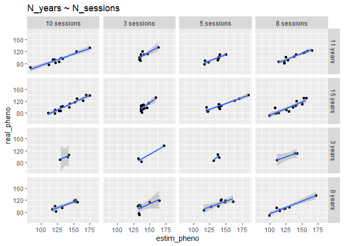
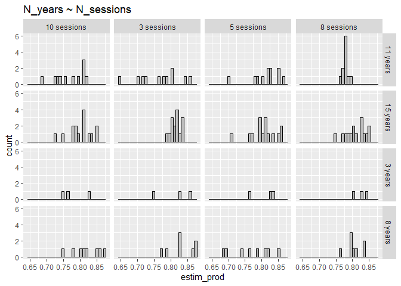

6_explore_sampling_designs
================
Paul Cuchot
2024-08-02

``` r
require(tidyverse)
require(truncnorm)
require(R2jags)
```

1)  function to simulate data

``` r
simul_data <- function(n_breeders = 10, # number of pair
                       n_years = 10, 
                       n_session = 50, 
                       start_ces = 100,
                       end_ces = 200,
                       mean_ld_site = 90,
                       selection_stre_ld = -0.003,
                       sd_ld = 7,
                       # mean number of eggs per pair
                       mean_eggs = 8){
  
  
  # mean laying date (among breeding individuals - change between years)
  mean_ld <- round(rnorm(n_years, mean_ld_site, 15)) # (real pheno)
  
  # for selection/variance explorations
  # mean_ld <- 100
  
  
  
  # final data_set
  df_site <- data.frame(t = NA,
                        n_capt_adults = NA,
                        n_capt_juveniles = NA, 
                        prod = NA,
                        year = NA)[0,] 
  
  
  for(k in 1:n_years){
    
    ## PHENOLOGY ##
    
    # sample n_breeders laying events
    ld_dates <- round(rnorm(n_breeders, 
                            mean = mean_ld[k], 
                            sd = sd_ld))# or sd_ld[k]
    
    # fledglings dates (40 = incubation time + rising)
    # imply that they all fledge at the same time 
    
    fledgl_dates <- round(ld_dates)+40
    
    # number of eggs per pair
    
    ## FECUNDITY ##
    
    n_eggs <- rpois(n_breeders, 
                    lambda = mean_eggs*exp(selection_stre_ld*ld_dates))
    
    
    # create a dataframe (one row per breeding pair)
    df_breed <- data.frame(
      ld_date = ld_dates,
      n_egg = n_eggs,
      fledgl_dates = fledgl_dates
    )
    
    
    #### sample (as CES design) #### 
    
    # choose days for capture session
    t_capt <- round(seq(start_ces, end_ces, 
                        length.out = n_session))
    
    # Number of sample individual per session (~capture effort)
    # for now: does not vary along the season
    
    mean_n_capt <- 30
    
    # Dataframe with n_adults and n_juveniles captured per session
    df_session <- data.frame(t = t_capt,
                             n_capt_adults = NA,
                             n_capt_juveniles = NA,
                             prod = NA,
                             year = as.character(k)) 
    
    for(i in t_capt){
      
      # catchable adults (no variation of survival during the season)
      n_adults <- n_breeders * 2
      
      # catchable juveniles (no variation of survival during the season)
      n_juveniles <- sum(df_breed[df_breed$fledgl_date < i ,]$n_egg)
      
      # sample birds among available individuals
      capt_indiv <- sample( 
        c(rep(0,n_adults), # adults
          rep(1,n_juveniles)), # juveniles
        rpois(1,mean_n_capt),
        
        replace = TRUE # allow recapture
      ) 
      
      # --> adults and juveniles have the same capture probability
      
      # how many adults
      df_session[df_session$t == i,"n_capt_adults"] <- sum(capt_indiv == 0)
      
      # how many juveniles
      df_session[df_session$t ==i,"n_capt_juveniles"] <- sum(capt_indiv == 1) 
      
    }
    
    # calculate productivity
    df_session <- df_session%>%
      mutate(prod = n_capt_juveniles/(n_capt_adults+n_capt_juveniles))
    
    df_site <- rbind(df_site, df_session)
    
  }
  
  # df with mean ld per year ("real breeding date")
  df_mean_ld <- data.frame(year = 1:n_years,
                           mean_ld = mean_ld)
  
  return(list(capt_sess = df_site, 
              mean_ld_year = df_mean_ld))
  
}
```

2)  Define model

``` r
model <- "model{

  # loop on capture session

  for(i in 1:N){

    ## likelihood
    n0[i] ~ dbin(p[i], nt[i])
    
    p[i] <- asig[an[i]]/(1+exp((csig[an[i]]-date[i])/dsig[an[i]]))
  }


  # loop on an_site_sp

  for (ii in 1:N_an){

  # csig parameter
  
    csig[ii] ~ dnorm(mu[ii], tau_res)

    mu[ii] <- mean_pheno + random_csig_an[an[ii]]

    
  # scale parameter
  
    dsig[ii] ~ dnorm(mu_dsig[ii], tau_res_dsig)
    
    mu_dsig[ii] <- mean_scale + random_dsig_an[an[ii]] 


  # asymptote parameter  
  
    asig[ii] ~ dnorm(mu_asig[ii], tau_res_asig)T(0.5,1)
    
    mu_asig[ii] <- mean_asymp + random_asig_an[an[ii]]
    
  }
  
  # random year effect
  
  for(z in 1:N_an){ #number of year
  
    random_csig_an[z] ~ dnorm(0, tau_csig_an)
    random_dsig_an[z] ~ dnorm(0, tau_dsig_an)
    random_asig_an[z] ~ dnorm(0, tau_asig_an)
  
  }

# priors

    mean_pheno ~ dnorm(150,0.01)

    mean_asymp ~ dnorm(0,0.01)T(0,1)
    
    mean_scale ~ dnorm(0,0.01)T(0,10)


  # random effect site

  sigma_res ~ dt(0, 0.01, 1)T(0,200) # Residual standard deviation
  sigma_res_dsig ~ dt(0, 0.01, 1)T(0,10) # Residual standard deviation
  sigma_res_asig ~ dt(0, 0.01, 1)T(0,1) # Residual standard deviation

  tau_res <- 1/(sigma_res*sigma_res)
  tau_res_dsig <- 1/(sigma_res_dsig*sigma_res_dsig)
  tau_res_asig <- 1/(sigma_res_asig*sigma_res_asig)

  #csig an (variance is the same for both species)
  sigma_csig_an ~ dt(0, 0.01, 1)T(0,200)
  tau_csig_an <- pow(sigma_csig_an, -2)
 
  # dsig an
  sigma_dsig_an ~ dt(0, 0.01, 1)T(0,20)
  tau_dsig_an <- pow(sigma_dsig_an, -2)

  # asig an
  sigma_asig_an ~ dt(0, 0.01, 1)T(0,1)
  tau_asig_an <- pow(sigma_asig_an, -2)


}
"
```

``` r
# parameter to save 
parameters3 <- c("asig","csig","dsig")
```

## Explore sampling parameters

Run 16 models with differents sets of simulated data:

- **REALISTIC sampling design**
- years \<- c(3,8,11,15)
- sessions \<- c(3,5,8,10)

### Phenology

- 

``` r
data_f <- bind_rows(res_l)

data_f%>%
  ggplot(aes(x = estim_pheno, y = real_pheno))+
  geom_point()+
  stat_smooth(method = 'lm')+
  facet_grid(years~sessions)+
    ggtitle("N_years ~ N_sessions")+
  ylim(c(50,190))
```

    ## `geom_smooth()` using formula = 'y ~ x'

    ## Warning in max(ids, na.rm = TRUE): aucun argument pour max ; -Inf est renvoyé

    ## Warning in max(ids, na.rm = TRUE): aucun argument pour max ; -Inf est renvoyé

<!-- -->

### Productivity

- 

``` r
data_f <- bind_rows(res_l)

data_f%>%
  ggplot(aes(x = estim_prod))+
  geom_histogram(color = 'black',fill = "grey")+
  facet_grid(years~sessions)+
  ggtitle("N_years ~ N_sessions")
```

    ## `stat_bin()` using `bins = 30`. Pick better value with `binwidth`.

<!-- -->
