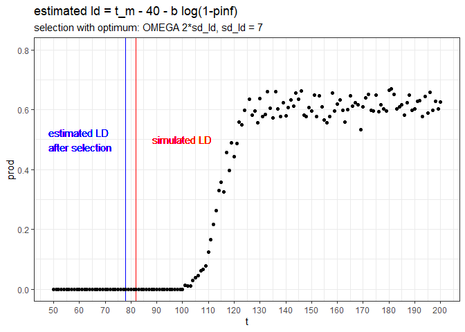

7_optimum
================
Paul Cuchot
2024-08-05

### Function to simulate data

``` r
simul_data <- function(n_breeders = 1000, # number of pair
                       n_years = 10, 
                       n_session = 100, 
                       start_ces = 100,
                       end_ces = 200,
                       mean_ld_site = 90,
                       selection_stre_ld = -0.003,
                       sd_ld = 7,
                       fact_omega = 2,
                       # mean number of eggs per pair
                       mean_eggs = 8){
  
  
  # mean laying date (among breeding individuals - change between years)
  mean_ld <- round(rnorm(n_years, mean_ld_site, 15)) # (real pheno)
  
  # for selection/variance explorations
  # mean_ld <- 100
  
  # final data_set
  df_site <- data.frame(t = NA,
                        n_capt_adults = NA,
                        n_capt_juveniles = NA, 
                        prod = NA,
                        year = NA)[0,] 
  
  
  for(k in 1:n_years){
    
    ## PHENOLOGY ##
    
    # sample n_breeders laying events
    ld_dates <- round(rnorm(n_breeders, 
                            mean = mean_ld[k], 
                            sd = sd_ld))# or sd_ld[k]
    
    # fledglings dates (40 = incubation time + rising)
    # imply that they all fledge at the same time 
    
    fledgl_dates <- ld_dates+40
    
    ## FECUNDITY ##
    
    # optimum
    omega2 <-  fact_omega*sd_ld  # peak width
    
    shiftopt <- 20  # shift of mean phenotype from optimum = delay in repro
    
    opt <- mean_ld[k] - shiftopt
    
    #fitness function
    fitness <- exp(-(ld_dates - opt)^2/(2*omega2^2))
    
    n_eggs <- rpois(n_breeders, 
                    lambda = mean_eggs*fitness)
    
    # create a dataframe (one row per breeding pair)
    df_breed <- data.frame(
      ld_date = ld_dates,
      n_egg = n_eggs,
      fledgl_dates = fledgl_dates
    )
    
    
    #### sample (as CES design) #### 
    
    # choose days for capture session
    t_capt <- round(seq(start_ces, end_ces, 
                        length.out = n_session))
    
    # Number of sample individual per session (~capture effort)
    # for now: does not vary along the season
    
    mean_n_capt <- 200
    
    # Dataframe with n_adults and n_juveniles captured per session
    df_session <- data.frame(t = t_capt,
                             n_capt_adults = NA,
                             n_capt_juveniles = NA,
                             prod = NA,
                             year = as.character(k)) 
    
    for(i in t_capt){
      
      # catchable adults (no variation of survival during the season)
      n_adults <- n_breeders * 2
      
      # catchable juveniles (no variation of survival during the season)
      n_juveniles <- sum(df_breed[df_breed$fledgl_date < i ,]$n_egg)
      
      # sample birds among available individuals
      capt_indiv <- sample( 
        c(rep(0,n_adults), # adults
          rep(1,n_juveniles)), # juveniles
        rpois(1,mean_n_capt),
        
        replace = TRUE # allow recapture
      ) 
      
      # --> adults and juveniles have the same capture probability
      
      # how many adults
      df_session[df_session$t == i,"n_capt_adults"] <- sum(capt_indiv == 0)
      
      # how many juveniles
      df_session[df_session$t ==i,"n_capt_juveniles"] <- sum(capt_indiv == 1) 
      
    }
    
    # calculate productivity
    df_session <- df_session%>%
      mutate(prod = n_capt_juveniles/(n_capt_adults+n_capt_juveniles))
    
    df_site <- rbind(df_site, df_session)
    
  }
  
  # df with mean ld per year ("real breeding date")
  df_mean_ld <- data.frame(year = 1:n_years,
                           mean_ld = mean_ld)
  
  return(list(capt_sess = df_site, 
              mean_ld_year = df_mean_ld))
  
}
```

### simulate data for a single year

``` r
data1 <- simul_data(n_breeders = 1000, # number of pair
                    n_years = 1, 
                    n_session = 150, 
                    start_ces = 50,
                    end_ces = 200,
                    mean_ld_site = 90,
                    selection_stre_ld = -0.003,
                    sd_ld = 7,
                    fact_omega = 2,
                    # mean number of eggs per pair
                    mean_eggs = 8)
```

### plot simulated data

``` r
data1$capt_sess%>%
  ggplot(aes(x = t, y = prod, color = as.character(year)))+
  geom_point()+
  geom_point(data = data1$mean_ld_year,
             aes(x = mean_ld, y = rep(0,1),
                 fill = as.character(year)), 
             shape=23, color="black", size=3)+
  geom_line(alpha = 0.3)+
  ylim(c(0,1))+
  theme_light()+ theme(legend.position = "none")+
  ggtitle("Producitivity along the breeding season",
         sub = "colored square corresponds to simulated mean laying date")
```

<!-- --> \### fit
non linear model with brms

``` r
fit_loss <- brm(
  bf(
    prod ~ pinf/(1+exp((tm-t)/b)), 
    pinf ~ 1, tm ~ 1, b ~ 1,
    nl = TRUE),
  data = data1$capt_sess, family = gaussian(link = "identity"),
  prior = c(
    prior(normal(0.7, 0.1), nlpar = "pinf"), # hist(rnorm(1000, 0.7, 0.1))
    prior(normal(125, 40), nlpar = "tm"), # hist(rnorm(1000, 130, 40))
    prior(normal(3, 5), nlpar = "b")
  ),
  control = list(adapt_delta = 0.9))
```

    ## 
    ## SAMPLING FOR MODEL 'anon_model' NOW (CHAIN 1).
    ## Chain 1: 
    ## Chain 1: Gradient evaluation took 9.5e-05 seconds
    ## Chain 1: 1000 transitions using 10 leapfrog steps per transition would take 0.95 seconds.
    ## Chain 1: Adjust your expectations accordingly!
    ## Chain 1: 
    ## Chain 1: 
    ## Chain 1: Iteration:    1 / 2000 [  0%]  (Warmup)
    ## Chain 1: Iteration:  200 / 2000 [ 10%]  (Warmup)
    ## Chain 1: Iteration:  400 / 2000 [ 20%]  (Warmup)
    ## Chain 1: Iteration:  600 / 2000 [ 30%]  (Warmup)
    ## Chain 1: Iteration:  800 / 2000 [ 40%]  (Warmup)
    ## Chain 1: Iteration: 1000 / 2000 [ 50%]  (Warmup)
    ## Chain 1: Iteration: 1001 / 2000 [ 50%]  (Sampling)
    ## Chain 1: Iteration: 1200 / 2000 [ 60%]  (Sampling)
    ## Chain 1: Iteration: 1400 / 2000 [ 70%]  (Sampling)
    ## Chain 1: Iteration: 1600 / 2000 [ 80%]  (Sampling)
    ## Chain 1: Iteration: 1800 / 2000 [ 90%]  (Sampling)
    ## Chain 1: Iteration: 2000 / 2000 [100%]  (Sampling)
    ## Chain 1: 
    ## Chain 1:  Elapsed Time: 0.346 seconds (Warm-up)
    ## Chain 1:                0.149 seconds (Sampling)
    ## Chain 1:                0.495 seconds (Total)
    ## Chain 1: 
    ## 
    ## SAMPLING FOR MODEL 'anon_model' NOW (CHAIN 2).
    ## Chain 2: 
    ## Chain 2: Gradient evaluation took 2.4e-05 seconds
    ## Chain 2: 1000 transitions using 10 leapfrog steps per transition would take 0.24 seconds.
    ## Chain 2: Adjust your expectations accordingly!
    ## Chain 2: 
    ## Chain 2: 
    ## Chain 2: Iteration:    1 / 2000 [  0%]  (Warmup)
    ## Chain 2: Iteration:  200 / 2000 [ 10%]  (Warmup)
    ## Chain 2: Iteration:  400 / 2000 [ 20%]  (Warmup)
    ## Chain 2: Iteration:  600 / 2000 [ 30%]  (Warmup)
    ## Chain 2: Iteration:  800 / 2000 [ 40%]  (Warmup)
    ## Chain 2: Iteration: 1000 / 2000 [ 50%]  (Warmup)
    ## Chain 2: Iteration: 1001 / 2000 [ 50%]  (Sampling)
    ## Chain 2: Iteration: 1200 / 2000 [ 60%]  (Sampling)
    ## Chain 2: Iteration: 1400 / 2000 [ 70%]  (Sampling)
    ## Chain 2: Iteration: 1600 / 2000 [ 80%]  (Sampling)
    ## Chain 2: Iteration: 1800 / 2000 [ 90%]  (Sampling)
    ## Chain 2: Iteration: 2000 / 2000 [100%]  (Sampling)
    ## Chain 2: 
    ## Chain 2:  Elapsed Time: 0.396 seconds (Warm-up)
    ## Chain 2:                0.151 seconds (Sampling)
    ## Chain 2:                0.547 seconds (Total)
    ## Chain 2: 
    ## 
    ## SAMPLING FOR MODEL 'anon_model' NOW (CHAIN 3).
    ## Chain 3: 
    ## Chain 3: Gradient evaluation took 2.5e-05 seconds
    ## Chain 3: 1000 transitions using 10 leapfrog steps per transition would take 0.25 seconds.
    ## Chain 3: Adjust your expectations accordingly!
    ## Chain 3: 
    ## Chain 3: 
    ## Chain 3: Iteration:    1 / 2000 [  0%]  (Warmup)
    ## Chain 3: Iteration:  200 / 2000 [ 10%]  (Warmup)
    ## Chain 3: Iteration:  400 / 2000 [ 20%]  (Warmup)
    ## Chain 3: Iteration:  600 / 2000 [ 30%]  (Warmup)
    ## Chain 3: Iteration:  800 / 2000 [ 40%]  (Warmup)
    ## Chain 3: Iteration: 1000 / 2000 [ 50%]  (Warmup)
    ## Chain 3: Iteration: 1001 / 2000 [ 50%]  (Sampling)
    ## Chain 3: Iteration: 1200 / 2000 [ 60%]  (Sampling)
    ## Chain 3: Iteration: 1400 / 2000 [ 70%]  (Sampling)
    ## Chain 3: Iteration: 1600 / 2000 [ 80%]  (Sampling)
    ## Chain 3: Iteration: 1800 / 2000 [ 90%]  (Sampling)
    ## Chain 3: Iteration: 2000 / 2000 [100%]  (Sampling)
    ## Chain 3: 
    ## Chain 3:  Elapsed Time: 0.349 seconds (Warm-up)
    ## Chain 3:                0.143 seconds (Sampling)
    ## Chain 3:                0.492 seconds (Total)
    ## Chain 3: 
    ## 
    ## SAMPLING FOR MODEL 'anon_model' NOW (CHAIN 4).
    ## Chain 4: 
    ## Chain 4: Gradient evaluation took 2.5e-05 seconds
    ## Chain 4: 1000 transitions using 10 leapfrog steps per transition would take 0.25 seconds.
    ## Chain 4: Adjust your expectations accordingly!
    ## Chain 4: 
    ## Chain 4: 
    ## Chain 4: Iteration:    1 / 2000 [  0%]  (Warmup)
    ## Chain 4: Iteration:  200 / 2000 [ 10%]  (Warmup)
    ## Chain 4: Iteration:  400 / 2000 [ 20%]  (Warmup)
    ## Chain 4: Iteration:  600 / 2000 [ 30%]  (Warmup)
    ## Chain 4: Iteration:  800 / 2000 [ 40%]  (Warmup)
    ## Chain 4: Iteration: 1000 / 2000 [ 50%]  (Warmup)
    ## Chain 4: Iteration: 1001 / 2000 [ 50%]  (Sampling)
    ## Chain 4: Iteration: 1200 / 2000 [ 60%]  (Sampling)
    ## Chain 4: Iteration: 1400 / 2000 [ 70%]  (Sampling)
    ## Chain 4: Iteration: 1600 / 2000 [ 80%]  (Sampling)
    ## Chain 4: Iteration: 1800 / 2000 [ 90%]  (Sampling)
    ## Chain 4: Iteration: 2000 / 2000 [100%]  (Sampling)
    ## Chain 4: 
    ## Chain 4:  Elapsed Time: 0.43 seconds (Warm-up)
    ## Chain 4:                0.149 seconds (Sampling)
    ## Chain 4:                0.579 seconds (Total)
    ## Chain 4:

``` r
fit_loss
```

    ##  Family: gaussian 
    ##   Links: mu = identity; sigma = identity 
    ## Formula: prod ~ pinf/(1 + exp((tm - t)/b)) 
    ##          pinf ~ 1
    ##          tm ~ 1
    ##          b ~ 1
    ##    Data: data1$capt_sess (Number of observations: 150) 
    ##   Draws: 4 chains, each with iter = 2000; warmup = 1000; thin = 1;
    ##          total post-warmup draws = 4000
    ## 
    ## Population-Level Effects: 
    ##                Estimate Est.Error l-95% CI u-95% CI Rhat Bulk_ESS Tail_ESS
    ## pinf_Intercept     0.61      0.00     0.61     0.62 1.00     4290     3305
    ## tm_Intercept     114.54      0.19   114.16   114.93 1.00     3226     2819
    ## b_Intercept        3.62      0.16     3.31     3.95 1.00     3812     2684
    ## 
    ## Family Specific Parameters: 
    ##       Estimate Est.Error l-95% CI u-95% CI Rhat Bulk_ESS Tail_ESS
    ## sigma     0.02      0.00     0.02     0.03 1.00     3818     2907
    ## 
    ## Draws were sampled using sampling(NUTS). For each parameter, Bulk_ESS
    ## and Tail_ESS are effective sample size measures, and Rhat is the potential
    ## scale reduction factor on split chains (at convergence, Rhat = 1).

### plot model predictions

``` r
plot(conditional_effects(fit_loss), points = TRUE)
```

<!-- -->

``` r
# transform model into matrix (one raw per iteration)
md_df <- as.data.frame(as.matrix(as.mcmc(fit_loss)))
```

    ## Warning: as.mcmc.brmsfit is deprecated and will eventually be removed.

### estimated mean breeding time after selection (from luis doc)

$est_{mean.layingdate}= t_m - 40 - log(1-pinf)$

``` r
md_df <- md_df%>%
  mutate(ld_after_selection = 
           b_tm_Intercept-40-(b_b_Intercept*log(1-b_pinf_Intercept)))
```

The estimated mean laying date after selection is 77.9773096 while the
simulated one (before selection) is 82.

### estimated variance (from luis doc)

- simulated laying date variance = 49 (BEFORE SELECTION)

$est_{variance.layingdate}= {\pi²b²}/3$

``` r
# (pi²b²)/3
md_df <- md_df%>%
  mutate(est_var_ld = (pi^2*b_b_Intercept^2)/3)

print(mean(md_df$est_var_ld))
```

    ## [1] 43.18422

The estimated variance of laying date after selection is 43.1842223
while the simulated one (before selection) is 49.

### plot productivity data, with before and after selection mean laying dates

``` r
md_df%>%
  ggplot()+
  # estimated laying date after selection
  geom_vline(aes(xintercept = mean(md_df$ld_after_selection)), col = "blue")+
  # simulated laying date 
  geom_vline(data = data1$mean_ld_year,
             aes(xintercept = mean_ld), color = "red")+
  # simulated data
  geom_point(data = data1$capt_sess, aes(x = t, y = prod), 
             color = "black")+
  geom_text(
    x = 60,
    y = 0.5,
    label = 'estimated LD\n after selection',
    # size = 4, # font size
    show.legend = FALSE,
    color = 'blue'
  )+
  geom_text(
    x = 100,
    y = 0.5,
    label = 'simulated LD',
    # size = 4, # font size
    show.legend = FALSE,
    color = 'red'
  )+
  ylim(c(0,0.8))+
  theme_bw()+
  theme(legend.position = "none")+
  scale_x_continuous(breaks = seq(50, 200, by = 10))+
  ggtitle("estimated ld = t_m - 40 - b log(1-pinf)",
          sub = "selection with optimum: OMEGA 2*sd_ld, sd_ld = 7")
```

    ## Warning: Use of `md_df$ld_after_selection` is discouraged.
    ## ℹ Use `ld_after_selection` instead.

<!-- -->
